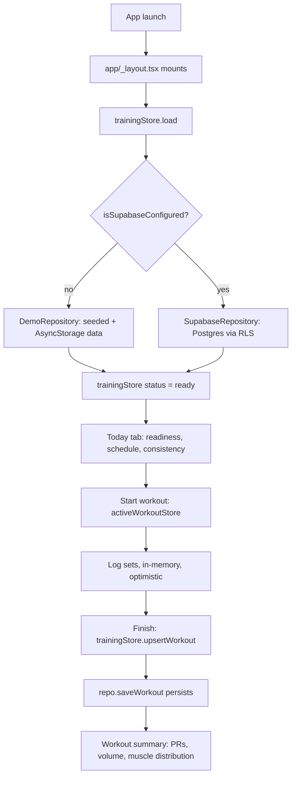

# PRism Architecture

## Document Status

- **Status:** Draft for review
- **Date:** 2026-07-25
- **Repository commit reviewed:** `2490c8de94b6492c2c20a3a91299313c30042320` (branch `main`, working tree clean, no staged/unstaged changes at time of review — verified via `git status`).
- **Current baseline (2026-07-29):** `main` is at `c59cbdb12d8ba2374d4d22ad6a9f8e0b91481fcb`. Everything merged between the reviewed commit and that baseline was documentation-only (product-intent-and-guardrails, architecture-baseline-audit, readiness-inputs-and-confidence-foundation planning); no code, schema, or test changed, so this document's findings held up to that point. **The `readiness-inputs-and-confidence-foundation` implementation sprint then changed code**: the check-in path, `src/domain/types.ts`, and `src/domain/calc/readiness.ts` no longer match this document's description of them. Findings touching those files are superseded by that sprint and by `Docs/invariants.md` I-7 and I-18; the rest of this document was not re-verified from 2026-07-29 to 2026-08-01.
- **Delta since the 2026-08-01 refresh (recorded 2026-08-03, not a full re-verification):** two
  feature sprints have landed on top of that baseline. `workout-session-continuity-v1`
  (2026-08-02) added the `workout/templates` route and local active-workout draft recovery;
  `workout-history-v1` (2026-08-03) added the `history`/`history/[id]` routes, the pure
  `src/domain/history.ts` derivation layer, and entry points from Today and Insights. Neither
  touched `src/data/repository.ts`, the stores' data contracts, or `supabase/migrations/`, so this
  document's Data Architecture, Security and Known Gaps sections are unchanged by them — G-1 (no
  auth path) and G-2 (non-atomic `saveWorkout`) both remain open. The route map below and the test
  counts are updated inline; nothing else in this document was re-verified on 2026-08-03. Current
  suite: **153 tests, 12 suites** (`npm test -- --ci`), typecheck clean. A third sprint,
  `today-insights-cohesion` (2026-08-03), then changed presentation only on those two screens —
  no data-layer, schema or store change — and added `src/content/deeperSurfaces.ts` as the single
  source of truth for the Progress/Body/History navigation row both screens render. Suite after it:
  **163 tests, 13 suites**, typecheck clean. A fourth, `logger-ux-polish` (2026-08-04), then
  polished the workout logger — confirmations in front of the two destructive removals, one shared
  set-type vocabulary in `src/content/setTypes.ts`, and the header metric relabelled "Sets done" so
  it stops colliding with the summary's warm-up-excluding "Working sets". Again presentation only:
  no data-layer, schema or store-contract change. Suite after it: **177 tests, 14 suites**,
  typecheck clean.
- **Baseline refresh (2026-08-01):** Re-verified against `main` after the `rls-policy-verification` → `rls-migration-fix` → `dependency-hygiene` → `cleanup-batch` sprint sequence (a pre-feature-readiness closure pass — see `Docs/readiness/2026-07-31-closure-inventory.md`). Commands re-run this session: `npm run typecheck` (clean), `npm test -- --ci` (**103/103 passed, 9 suites** — up from the 40/40, 1-suite baseline below), `npx expo-doctor` (**20/20**), `npm audit` (**11 moderate**, down from an unrecorded-here 36; the 1 high finding is fixed, the 11 moderate are confirmed unfixable short of a major, breaking Expo downgrade — see `Docs/sprints/2026-08-01-dependency-hygiene.md`). Material changes since 2026-07-29, superseding specific claims below where noted inline: (1) both security sprints landed (Keychain session storage, CSPRNG ids, server-derived write ownership, migration `0002_security_hardening.sql`); (2) the RLS migration defect is **fixed** — `supabase/migrations/0001_init.sql` now applies cleanly and 57/57 cross-tenant isolation assertions pass against the actual committed file (`Docs/sprints/2026-08-01-rls-migration-fix.md`), closing `Docs/invariants.md` I-1; (3) the UI was restructured to a five-tab bar (Today/Exercises/Insights/Social/Plans) with an onboarding flow, and all seven data-driven screens now share a loading/error/empty-state primitive (`ScreenState`); (4) a brand icon/splash asset pipeline (`assets/brand/`, `scripts/generate-app-icons.sh`) was added, including an Android Themed-Icons monochrome layer; (5) `react-hook-form`/`zod`/`@hookform/resolvers` were removed (previously unused); (6) the unreachable `CheckIn.note` field and the dead `Stepper.tsx` component were removed. This document's Known Gaps table is updated inline below rather than restating findings that no longer hold.
- **Scope:** A read-only, evidence-based inventory of the current state of the PRism repository — code, schema, tests, CI, and configuration as they exist today.
- **Non-goals:** This document does not propose a future architecture, does not create new process documents (invariants, ADRs, product intent), and does not evaluate anything outside this repository (App Store/Play listing, backend infrastructure beyond the committed SQL migration, third-party services). It is not a design review of the visual/UX system beyond what is verifiable from code.

---

## Executive Summary

**What is currently working (verified):**
- The app boots, typechecks, and passes its full test suite with zero errors (`npm run typecheck` → clean; `npm test -- --ci` → **103/103 tests passed, 9 suites** as of 2026-08-01, up from 40/40 in 1 suite at this document's original review; `npx expo-doctor` → 20/20 checks passed).
- **RLS policies are now demonstrated correct and deployable, not just written.** `supabase/migrations/0001_init.sql` applies cleanly (a previously-undiscovered non-immutable index expression was fixed 2026-08-01) and an automated 57-assertion suite (`supabase/tests/rls/`) confirms cross-tenant isolation across all 11 tables and every CRUD operation, against the actual committed migration file, reproduced twice from a clean database and once more on a real hosted Supabase project. See `Docs/invariants.md` I-1 and `Docs/sprints/2026-08-01-rls-migration-fix.md`. This does not mean production/non-demo mode is reachable by a real user yet — see the authentication gap below, unchanged.
- A complete **demo mode** runs the entire app on deterministic, locally generated data with zero network calls and zero configuration (`src/data/demoSeed.ts`, `src/data/repository.ts`).
- A pure, thoroughly unit-tested **calculation engine** (`src/domain/calc/`) implements 1RM estimation, volume, PR detection, recovery estimation, a composite readiness score, and next-load recommendations.
- A **Supabase/Postgres schema** with row-level security exists and is checked into the repo (`supabase/migrations/0001_init.sql`), covering 11 tables and a consistent ownership model.
- One full user workflow — start a session, log sets, finish, see a summary — is implemented end-to-end in the demo backend: `app/(tabs)/index.tsx` → `app/workout/active.tsx` → `app/workout/summary.tsx`.

**What is demo-only, mocked, partial, or unknown:**
- The Supabase backend path (`SupabaseRepository` in `src/data/repository.ts`) is implemented in code but has **no evidence in this repository of having been executed against a live Supabase project** — there is no integration test, no CI job, and no auth UI to obtain a session. This is unknown / needs confirmation, not a confirmed defect.
- There is **no authentication UI anywhere in the app** (`app/` contains no sign-in/sign-up/sign-out screens; confirmed by search). Supabase mode requires a signed-in user (`SupabaseRepository.uid()` throws otherwise), but nothing in this repository can produce that session.
- Tabs **Progress, Body, Insights, and Plans** are explicitly labelled in-code and in the README as partial: each renders real calculations today but ships a `PhasePanel` describing unbuilt future scope (interactive charts, SVG body map, recommendation engine, plan editor).
- No CI job runs against a real Supabase instance, and no automated test exercises `SupabaseRepository`, RLS policies, or the migration itself.
- Native `ios/` and `android/` directories are git-ignored and regenerated locally via `expo prebuild` — this repository's tracked source is the Expo-managed layer only.

**Five most material architecture / launch risks (updated 2026-08-01):**
1. **No authentication path exists**, so the Supabase (production) backend is currently unreachable by any UI in this repository — demo mode is the only mode a user can actually run. **Unchanged** — this is now the single most material gap, since the RLS blocker beneath it (below) is resolved.
2. **Multi-record workout writes are still not atomic** — `SupabaseRepository.saveWorkout` performs three sequential, non-transactional upserts (see G-2 below). A failure mid-save can leave a workout with missing exercises/sets. **Unchanged**, and now the most material *data-integrity* gap given RLS itself is verified.
3. **No observability** — no crash reporting, analytics, or logging pipeline was found in dependencies or source. **Unchanged.**
4. **No CD/release pipeline** — CI covers typecheck and test only; there is no `eas.json`, no EAS build/submit workflow, and no App Store/Play release automation in this repository. **Unchanged.**
5. **Residual dependency vulnerabilities** — `npm audit` reports 11 moderate findings, all transitive through `xcode`/`@expo/config-plugins` (`expo prebuild`-time tooling, not shipped in the app bundle). Confirmed unfixable without a major, breaking Expo downgrade; tracked as accepted risk pending an upstream fix (`Docs/sprints/2026-08-01-dependency-hygiene.md`).

~~Previously listed here, now resolved:~~ *RLS policies and the schema are unexercised* — **resolved 2026-08-01**, see above. *Unused dependencies present* (`react-hook-form`, `zod`, `@hookform/resolvers`) — **resolved 2026-08-01**, all three removed (confirmed zero imports before removal).

**This is an evidence-based current-state document, not a future-state design.** Every claim below is either marked *verified* (backed by a specific file, command output, or test), *inferred* (a reasonable reading of code that was not directly executed), or *unknown* (cannot be determined from this repository and requires confirmation).

---

## Product and System Boundaries

**Intended user outcome and core workflow** (source: `README.md`): PRism is a strength-training and workout-tracking app for intermediate lifters training 3–6 days/week. The core loop, as implemented, is: see today's readiness and scheduled session (Today tab) → start and log a workout set-by-set (Workout logger) → review a post-session summary with PRs and volume (Workout summary). Every derived number (readiness, recovery, load suggestions) ships with a plain-language rationale rather than being presented as an unexplained verdict — this is a stated design principle in the README and is verifiably implemented (`READINESS_EXPLANATION`, `RECOVERY_MODEL_EXPLANATION`, `LoadSuggestion.rationale`).

**In-scope platforms** (verified, `app.json` + `package.json`): iOS (`ios.bundleIdentifier: app.prism.trainer`, `supportsTablet: false`), Android (`android.package: app.prism.trainer`), and web (`web.bundler: metro`, `web.output: single`, plus `react-native-web` dependency and an `npm run web` script). No platform-specific code branches beyond a few `Platform.OS` checks in styling (e.g. `app/(tabs)/_layout.tsx`) were found.

**Explicit originality boundary for Liftly reference material:** The README's "Originality" section (`README.md`, final section) states in-repo that the design system, copy, exercise library, coaching cues, template plans, calculation model, and every UI component were written from scratch, and that Epley's formula, volume-as-weight-×-reps, and the acute:chronic ratio are cited as standard, public-domain strength-training mathematics rather than borrowed proprietary content. This document does not independently verify originality against any external product — that determination is out of scope for a code-only audit and is recorded here only as the stated project position.

**What this repository does and does not currently implement:**
- **Implements:** demo-mode data layer, calculation engine, Today/Workout logger/Exercise picker/Workout summary screens, Supabase schema + RLS (as SQL), a typed repository abstraction, design token system, Jest suite for the calc engine, CI for typecheck+test.
- **Does not implement (verified absent):** authentication screens, onboarding flow, settings screen, data export/delete UI (the README lists these as Phase 6 / "planned"), push notifications, analytics/crash reporting, EAS build configuration, any server-side code beyond the SQL migration, offline-queue/sync logic for the Supabase path.

---

## Technology Inventory

| Concern | Technology / Package | Version (verified) | Responsibility | Evidence |
|---|---|---|---|---|
| Framework | Expo | `^57.0.8` | Managed native runtime, build tooling | `package.json` |
| Mobile runtime | React Native | `0.86.0` | Cross-platform native rendering | `package.json` |
| UI library | React / React DOM | `19.2.3` | Component model | `package.json` |
| Language | TypeScript | `~6.0.3`, `strict: true` | Static typing across app/src | `package.json`, `tsconfig.json` |
| Routing | Expo Router | `~57.0.8` | File-based navigation, typed routes (`experiments.typedRoutes: true`) | `package.json`, `app.json` |
| State management | Zustand | `^5.0.3` | Two stores: persisted training data, ephemeral active-workout session | `package.json`, `src/store/*.ts` |
| Backend / data | Supabase (`@supabase/supabase-js`) | `^2.48.1` | Postgres + auth + RLS backend, optional (demo mode is default) | `package.json`, `src/data/supabase/client.ts` |
| Local persistence | `@react-native-async-storage/async-storage` | `2.2.0` | Demo-mode local writes; Supabase session storage | `src/data/repository.ts`, `src/data/supabase/client.ts` |
| Auth | Supabase Auth (client SDK only) | `^2.48.1` | `auth.getUser()` used to scope queries; **no sign-in/out UI exists** | `src/data/repository.ts` (`SupabaseRepository.uid()`) |
| Forms | *(removed 2026-08-01)* | — | `react-hook-form`, `@hookform/resolvers`, `zod` were declared but never imported anywhere in `app/` or `src/`; removed as dead weight (`Docs/sprints/2026-08-01-dependency-hygiene.md`). Auth and check-in forms use hand-rolled validation instead. | `git log` |
| Testing | Jest `^29.7.0` + `jest-expo` `~57.0.2` | — | Unit tests for `src/domain/calc` | `package.json`, `src/domain/calc/__tests__/calc.test.ts` |
| CI | GitHub Actions | — | Typecheck + test on push/PR to `main` | `.github/workflows/ci.yml` |
| Build / release | Expo CLI (`expo run:ios`/`run:android`), no EAS config | — | Local native builds only; no `eas.json` found in repo | `package.json` scripts; absence confirmed via file search |
| Environment config | `EXPO_PUBLIC_*` vars, inlined at build time | — | Demo-mode toggle + Supabase URL/anon key | `.env.example`, `src/data/supabase/client.ts` |
| Icons | `@expo/vector-icons` | `^15.0.2` | Ionicons used throughout tab bar and UI | `package.json`, `app/(tabs)/_layout.tsx` |
| Gestures/safe area | `react-native-gesture-handler` `~2.32.0`, `react-native-safe-area-context` `~5.7.0`, `react-native-screens` `~4.26.0` | — | Navigation plumbing required by Expo Router | `package.json`, `app/_layout.tsx` |
| Graphics | `react-native-svg` `15.15.4` | — | Present but no SVG component found in `src/components` yet (Phase 3 body map is "planned") | `package.json` |
| Haptics | `expo-haptics` `~57.0.1` | — | Feedback on set completion | `src/store/activeWorkoutStore.ts` |
| Keep-awake | `expo-keep-awake` `~57.0.1` | — | Prevents device sleep during a logged session | `app/workout/active.tsx` |

---

## Repository Map

```
prism/
├── app/                     # Expo Router — file-based routes only
│   ├── _layout.tsx          # Root stack: gesture root, safe area, data bootstrap
│   ├── (tabs)/               # Tab navigator: index, progress, body, insights, plans
│   └── workout/               # Modal/stack routes: active, picker, summary
├── src/
│   ├── theme/                # Design tokens: colour, spacing, radius, typography
│   ├── components/
│   │   ├── ui/                 # Primitives (Button, Card, Text, Screen, ...)
│   │   ├── today/               # Today-tab composite components
│   │   └── workout/              # Logger composite components
│   ├── domain/                # Pure logic — no React, no I/O (types, muscles,
│   │   │                       # schedule, calc/*) — enforced by convention, not lint
│   │   └── calc/                # oneRepMax, volume, prs, recovery, readiness,
│   │                            # loadRecommendation, __tests__/
│   ├── data/                  # Repository interface + demo & Supabase impls,
│   │   │                       # exercise library, routine templates, demo seed
│   │   └── supabase/             # client.ts (lazy client), mappers.ts (snake<->camel)
│   ├── store/                 # trainingStore (persisted read model),
│   │                          # activeWorkoutStore (ephemeral session state)
│   └── utils/                 # format.ts, id.ts
├── supabase/migrations/       # 0001_init.sql — schema + RLS, single migration
├── .github/workflows/ci.yml   # Typecheck + test on push/PR
├── ios/, android/             # Git-ignored, regenerated via `expo prebuild`
└── package.json / tsconfig.json / app.json / .env.example
```

**Additions since 2026-07-25, not reflected in the tree above (kept as originally drawn rather than
redrawn wholesale, to avoid introducing new unverified claims into a diagram):**
- `app/(tabs)/` gained `exercises.tsx` and `social.tsx`; the tab bar is five destinations
  (Today/Exercises/Insights/Social/Plans), with Progress and Body still routable but hidden from the
  bar (`href: null`).
- `app/onboarding/` — a first-run flow (splash, welcome, feature carousel, presentation-only auth,
  four-step setup, completion), gating first launch via a persisted flag in `app/_layout.tsx`.
- `assets/brand/` — the brand icon/splash source artwork and four generated derivatives (app icon,
  adaptive icon, splash icon, Android monochrome icon), plus `scripts/generate-app-icons.sh` and two
  Python helpers (`alpha-key.py`, `monochrome-key.py`), all deterministic/reproducible from the
  committed source.
- `supabase/migrations/0002_security_hardening.sql` — a second migration (`display_name` bounding, a
  cross-tenant exercise-visibility trigger), applied and verified in this repository as of 2026-08-01.
- `supabase/tests/rls/` — the RLS isolation test suite (57 SQL assertions + a runner script), not
  wired into CI.
- `src/store/onboardingStore.ts` — onboarding's local, `AsyncStorage`-only draft state.
- `src/components/ui/ScreenState.tsx` — the shared loading/error/empty-state primitive all seven
  data-driven screens now use.
- `src/content/` — user-facing copy held outside the screens that render it (`onboarding.ts`,
  `social.ts`; `deeperSurfaces.ts`, added 2026-08-03, the single source of truth for the
  Progress/Body/History navigation row that both Today and Insights draw from; and `setTypes.ts`,
  added 2026-08-04, the one set-type vocabulary shared by the logger and History).
- `src/domain/history.ts` + `app/history/` — the Workout History v1 derivation layer and its two
  screens (added 2026-08-03).

**Responsibility and dependency direction (verified by import inspection):**

- **`app/` (routes/screens):** Thin composition layer. Reads from `useTrainingStore` / `useActiveWorkoutStore`, calls `src/domain/calc` selectors, and renders `src/components`. No screen talks to `src/data` directly except via the stores.
- **`src/components/ui` and `src/components/{today,workout}`:** Presentational. Receive data and callbacks as props; import `src/theme` for styling. Do not call the repository or stores directly (verified for the files read; not exhaustively grepped for every component).
- **`src/domain` (business logic):** Pure functions and types. `src/domain/types.ts` documents itself as mirroring the SQL schema one-to-one. The README states the rule "`src/domain` never imports from `src/components`, `app/`, or `src/data`" — confirmed for every file read (`schedule.ts`, `readiness.ts`, `volume.ts`, `oneRepMax.ts`); no lint rule enforces this, so it is a convention, not a guarantee.
- **`src/store` (application/state):** `trainingStore` is a read model populated by the `Repository`; it holds no calculation logic itself and delegates all derived values to `src/domain/calc`. `activeWorkoutStore` is deliberately separate and ephemeral — an in-progress session is not persisted until `finish()` hands it to `trainingStore.upsertWorkout`, which calls the repository.
- **`src/data` (repositories/data access):** `repository.ts` defines the `Repository` interface and two implementations (`DemoRepository`, `SupabaseRepository`), selected once at module load via `getRepository()` based on `isSupabaseConfigured`. `supabase/client.ts` lazily constructs the Supabase client only when configured, so demo mode makes zero network calls.
- **Supabase/database:** A single SQL migration (`supabase/migrations/0001_init.sql`) is the only schema artifact in the repo. It is not applied by CI or any script found in `package.json` — applying it is a manual, documented step in the README ("SQL Editor, paste ... execute").
- **Tests:** Exist only for `src/domain/calc` (`src/domain/calc/__tests__/calc.test.ts`, 434 lines, 40 tests). No tests found for `src/data`, `src/store`, `app/`, or `src/components`.
- **Configuration/build/CI:** `app.json` (Expo config), `tsconfig.json` (strict TS, `@/*` path alias to `src/`), `.env.example` (documents three `EXPO_PUBLIC_*` variables), `.github/workflows/ci.yml` (Node 20, `npm ci`, typecheck, test).

---

## Runtime Architecture

**1. App startup and route entry** *(verified, `app/_layout.tsx`)*
Expo Router's entry point (`expo-router/entry`, `package.json` → `main`) mounts `app/_layout.tsx` as the root layout. It wraps the app in `GestureHandlerRootView` and `SafeAreaProvider`, sets the status bar, and defines a `Stack` with three top-level routes: `(tabs)` (the tab group), `workout/active` (slide-from-bottom, gestures disabled), and `workout/picker` (modal presentation). `workout/summary` is reachable via `app/workout/summary.tsx` but is not explicitly registered as a `Stack.Screen` in `_layout.tsx` — Expo Router's file-based convention still routes to it; this was not verified to have a specific `options` override.

**2. Environment / configuration loading** *(verified, `src/data/supabase/client.ts`)*
`EXPO_PUBLIC_DEMO_MODE`, `EXPO_PUBLIC_SUPABASE_URL`, and `EXPO_PUBLIC_SUPABASE_ANON_KEY` are read from `process.env` at module load (inlined into the bundle at build time by Expo's `EXPO_PUBLIC_` convention — not runtime-configurable post-build). No `.env` values are read by this audit; only variable names from `.env.example` are documented.

**3. Demo-mode vs. production-mode selection** *(verified, `src/data/repository.ts` + `src/data/supabase/client.ts`)*
`isSupabaseConfigured = !DEMO_MODE && url.length > 0 && anonKey.length > 0`. `getRepository()` is a lazily-initialized singleton: it constructs a `SupabaseRepository` if configured, otherwise a `DemoRepository`, and this decision is made once per app process (no runtime toggle). `DEMO_MODE` defaults to `true` when the env var is unset, matching the README's "no backend needed" claim.

**4. Data retrieval and state updates** *(verified, `src/store/trainingStore.ts`)*
`app/_layout.tsx` calls `useTrainingStore.getState().load()` once on mount. `load()` guards against re-entry (`if status is 'loading' or 'ready', return`) and delegates to `refresh()`, which sets `status: 'loading'`, fires eight repository calls in parallel via `Promise.all` (profile, exercises, routines, active routine, workouts, check-ins, measurements, personal records), and on success sets `status: 'ready'` with all data populated; on failure sets `status: 'error'` with a message. Screens key their loading/error UI off `status` (verified in `app/(tabs)/index.tsx`).

**5. Workout logging flow** *(verified, `src/store/activeWorkoutStore.ts` + `app/workout/active.tsx`)*
`activeWorkoutStore.start()` builds a `Workout` in memory, pre-populated with empty sets from the routine day's targets (or empty if an "open session"). All mutations (`updateSet`, `toggleSetComplete`, `addSet`, etc.) are synchronous, in-memory, and optimistic — nothing touches the repository until `finish()` is called. `finish()` strips any exercise with zero completed sets, stamps `endedAt`/`status: completed`, clears the active-workout store, and returns the finished `Workout`. The caller (`app/workout/active.tsx`, evidenced by import of `useTrainingStore`'s `upsertWorkout`) is responsible for calling `trainingStore.upsertWorkout(finished)`, which persists via `repo.saveWorkout()` and updates the read model. `toggleSetComplete` also fires a haptic and starts a rest timer.

**6. Calculation / insight flow** *(verified across `src/domain/calc/*.ts` and consuming screens)*
Screens do not store derived values — they call `src/domain/calc` functions inside `useMemo` on every render with the latest data from the stores. Example chain on the Today screen (`app/(tabs)/index.tsx`): `estimateRecovery()` → `computeReadiness()` → rendered by `ReadinessCard`; `volumeInWindow()` computes this-week vs. last-week volume for the consistency card. The same functions back Progress (`e1rmSeries`), Body (`estimateRecovery`), and Insights (`muscleDistribution`, `volumeInWindow`) screens — there is one calculation implementation reused across every surface, matching the README's "portable, testable in isolation" design goal.

**7. Error, loading, empty, and offline behavior**
- **Loading:** Verified — `TodayScreen` renders an `ActivityIndicator` while `status` is `'idle'`/`'loading'`.
- **Error:** Verified — `TodayScreen` renders a retry `Card` when `status === 'error'`, wired to `refresh()`. Other tabs (Progress, Body, Insights, Plans) were not observed to render a distinct error state; they consume `useTrainingStore` selectors directly and would render with empty/default data if `status` were `'error'`, since they do not branch on `status` (verified by reading each file — none references `s.status`). **This is a confirmed gap**, not an inference.
- **Empty:** Verified per-screen — Today shows "No plan is active yet..." when no session resolves; sections (fatigued muscles, recent PRs) are conditionally hidden when empty (`fatigued.length > 0`, `recentPrs.length > 0`).
- **Offline:** No offline-detection code was found (`NetInfo`, `isConnected`, or similar — searched across `app/` and `src/`, one unrelated match for the word "offline" in a comment in `src/theme/typography.ts`). Demo mode is inherently offline-capable since it never calls the network. The Supabase path's behavior when offline is **unknown** — `SupabaseRepository` calls will presumably reject and propagate an `Error` up to `trainingStore.refresh()`'s catch block, but this was not exercised by any test.



---

## Data Architecture

**Entities and relationships** *(verified, `supabase/migrations/0001_init.sql` and `src/domain/types.ts`, which the file's own header states mirrors the SQL 1:1)*:
`profiles` (1) → `workouts` (N) → `workout_exercises` (N) → `sets` (N); `profiles` → `routines` (N) → `routine_days` (N) → `routine_exercises` (N); `profiles` → `body_measurements`, `check_ins`, `personal_records` (N each); `exercises` is shared (system rows have `profile_id = null`) and referenced by `workout_exercises` and `routine_exercises`.

**Ownership and lifecycle:** Every user-owned row carries `profile_id`, and `profiles.id` references `auth.users(id) on delete cascade` — deleting the Supabase auth user cascades through the entire schema (verified in migration comments and FK definitions). A trigger (`handle_new_user`) auto-creates a `profiles` row on signup. In demo mode, there is no `auth.users` equivalent — `DemoRepository` uses a fixed `DEMO_PROFILE_ID` constant and persists only *user-logged* workouts/records/check-ins to `AsyncStorage` under fixed keys (`prism.demo.workouts.v1`, etc.); the seeded 8-week history is regenerated in memory each launch and merged with anything the user has logged.

**Demo data vs. Supabase data:** These are two structurally-identical but operationally distinct datasets behind one `Repository` interface (verified, `src/data/repository.ts`). Demo data has no expiry, sync, or multi-device concept — it is single-device, `AsyncStorage`-backed. A `resetDemoData()` function exists to wipe it back to the pristine seed.

**Repository abstraction and contracts:** The `Repository` interface (`src/data/repository.ts`) is the sole contract the UI depends on: `getProfile`, `updateProfile`, `listExercises`, `listRoutines`, `getActiveRoutine`, `listWorkouts`, `saveWorkout`, `deleteWorkout`, `listCheckIns`, `saveCheckIn`, `listMeasurements`, `listPersonalRecords`, `savePersonalRecords`. Both implementations satisfy it in full. `SupabaseRepository.saveWorkout` upserts the workout, its exercises, and its sets in three sequential calls (not a single transaction) — a partial failure mid-save (e.g. workout row succeeds, sets upsert fails) would leave Postgres in a partially-written state. This is a **confirmed code pattern**, not a confirmed production incident; no test exercises this path.

**Database migrations, RLS, and authorization posture:** One migration file, `0001_init.sql`, creates all tables, enums, indexes, the `updated_at` trigger, the `handle_new_user` trigger, and RLS policies for every table (`select`/`all` policies scoped to `auth.uid()`, with `exists`-walk policies for child tables lacking their own `profile_id`). No migration tooling (e.g. `supabase migration up`, a migrations runner script) was found in `package.json` — applying this file is a manual step per the README.

**Data integrity gaps or unknowns:**
- `saveWorkout`'s three-step upsert is not atomic (see above) — **likely risk**, unconfirmed by test.
- No automated verification that the RLS policies actually behave as written against a real Postgres instance — **unknown, requires validation** (e.g. via `supabase test db` or a CI job with a local Postgres container, neither of which exists in this repo).
- `exercises` table has a partial unique index (`lower(name), equipment) where profile_id is null`) preventing duplicate system exercises, but no equivalent constraint prevents a user from creating a duplicate personal exercise — **inferred, minor, not verified against runtime behavior**.

---

## Security and Privacy Posture

**Authentication/authorization implementation status:** Client-side Supabase Auth SDK is wired (`getSupabase().auth.getUser()` in `src/data/repository.ts`), but **no sign-in, sign-up, sign-out, or session-recovery screen exists anywhere in `app/`** (confirmed via search for `signIn`/`signUp`/`signOut` — zero matches outside the SDK/repository layer itself). Category: **confirmed issue** — the Supabase backend path cannot currently be reached by a real user through this app's UI.

**RLS status and evidence:** RLS is enabled on all 11 tables and policies exist for every table, scoped consistently to `auth.uid()` (verified, migration lines 275–387). Category: **confirmed** as *written*; **unknown requiring validation** as *enforced*, since no test applies the migration and asserts policy behavior (e.g. that user A cannot read user B's `workouts`).

**Environment variable names (values never read or reproduced):** `EXPO_PUBLIC_DEMO_MODE`, `EXPO_PUBLIC_SUPABASE_URL`, `EXPO_PUBLIC_SUPABASE_ANON_KEY` (source: `.env.example`). All three are `EXPO_PUBLIC_`-prefixed and therefore inlined into the client bundle by design — the README explicitly states the anon key is safe for this because RLS is the actual enforcement boundary, not variable secrecy. No service-role key or other server-only secret was found referenced anywhere in the repository.

**Client/server trust boundaries:** The client (mobile app) holds only the Supabase anon key and relies entirely on Postgres RLS for row-level authorization — there is no separate backend/API layer in this repository. This is a standard, low-risk Supabase pattern **if and only if** RLS is correct (see "unknown requiring validation" above), since the anon key alone grants no access without matching policies.

**Risks around user health/training data:** The schema stores body measurements (`body_measurements.bodyweight_kg`, `body_fat_pct`, `circumferences_cm`) and check-ins (sleep/energy/soreness/stress) — data a user might reasonably consider sensitive. Category: **likely risk, requires product decision** — no privacy policy, data-export, or data-deletion UI exists yet (README lists these as Phase 6/"planned"), even though the schema's cascade-delete design would make a "delete my account" feature straightforward to implement once auth exists.

**Secrets, logging, dependency, or data-access concerns:**
- No `.env` file contents were read or reproduced by this audit, per instruction.
- No structured logging, log-scrubbing, or PII-redaction code was found — **unknown**, since no logging framework exists at all yet to audit.
- `npm audit` was not run (not in the approved non-mutating command list for this sprint and not requested); dependency vulnerability posture is **unknown**.
- The `SupabaseRepository.saveWorkout` non-atomic multi-step upsert (see Data Architecture) is a **likely risk** for partial writes rather than a security issue per se.

---

## Navigation and UI Architecture

**Route map** *(verified, file-based routing under `app/`)*:

| Route | File | Type |
|---|---|---|
| `(tabs)/index` | `app/(tabs)/index.tsx` | Tab — Today |
| `(tabs)/progress` | `app/(tabs)/progress.tsx` | Tab — Progress |
| `(tabs)/body` | `app/(tabs)/body.tsx` | Tab — Body |
| `(tabs)/insights` | `app/(tabs)/insights.tsx` | Tab — Insights |
| `(tabs)/plans` | `app/(tabs)/plans.tsx` | Tab — Plans |
| `workout/active` | `app/workout/active.tsx` | Stack screen, slide-from-bottom, gestures disabled |
| `workout/picker` | `app/workout/picker.tsx` | Modal |
| `workout/summary` | `app/workout/summary.tsx` | Stack screen. **Updated 2026-08-03:** now registered explicitly in `app/_layout.tsx` (no options, so no behavioural change), closing the file-convention-only routing noted here and in `Docs/sprints/2026-08-02-workout-logging-v1-planning.md` §2.5 |
| `workout/templates` | `app/workout/templates.tsx` | Modal — "Choose a workout" (added 2026-08-02, `workout-session-continuity-v1`) |
| `history` | `app/history/index.tsx` | Stack screen — completed-workout list (added 2026-08-03, `workout-history-v1`) |
| `history/[id]` | `app/history/[id].tsx` | Stack screen — read-only session detail (added 2026-08-03, `workout-history-v1`) |

**Primary navigation:** A five-tab bottom bar (`app/(tabs)/_layout.tsx`), each tab with both an icon and a visible text label, plus an `accessibilityLabel`. Workout screens sit outside the tab navigator at the root `Stack` level so they cover the tab bar during an active session (stated design intent in `app/_layout.tsx` comment, confirmed by the `Stack.Screen` registration).

**Screen responsibilities:** Today = readiness + scheduled session + week consistency (see Runtime Architecture §6 for its exact calculation chain). Progress/Body/Insights/Plans each render real, currently-computed data plus a `PhasePanel` describing what's still planned for that phase (verified per-screen reads above). Workout logger/picker/summary form the session-logging flow.

**Shared component/design-system status:** A token-based theme (`src/theme/tokens.ts`, `typography.ts`) is the sole source of colour, spacing, radius, and type — verified via consistent `color`/`space`/`radius`/`type` imports across every screen and component read. A primitive component library exists in `src/components/ui` (Button, Card, Chip, Screen, SectionHeader, StatBlock, ReadinessRing, ConsistencyStrip, LinearSpectrum, Stepper, PhasePanel, Text) — **verified present**, not exhaustively verified for API consistency across every consumer.

**Accessibility and responsive/platform considerations verifiable from code:**
- `accessibilityRole`/`accessibilityLabel` are present on interactive elements in every component file read (`Button.tsx`, `Chip.tsx`, `SetRow.tsx`, `ReadinessRing.tsx` — the latter uses `accessibilityRole="progressbar"` with a numeric label, matching the README's claim).
- `hitSlop` is used on visually small controls (`Chip.tsx`, `SetRow.tsx` stepper buttons) to reach a larger touch target — verified in code; the README's specific "≥44pt" claim was not independently measured by this audit (no visual/rendered test was performed).
- Tab bar items enforce `minHeight: 44` (`app/(tabs)/_layout.tsx` styles) — verified.
- `maxFontSizeMultiplier` (README's font-scaling claim) was **not found** in any of the component files read during this audit (`Text.tsx`, `Button.tsx`, `Card.tsx`, `SetRow.tsx`) — **discrepancy noted**: this is either implemented in a file not read in this pass, or the README claim is currently aspirational. Flagged as **unknown, needs confirmation** rather than asserted either way.
- No platform-specific accessibility code (VoiceOver/TalkBack-specific branches) beyond standard React Native accessibility props was found.

---

## Quality and Operational Readiness

**Existing test suites and what they cover (original, 2026-07-25):** One suite, `src/domain/calc/__tests__/calc.test.ts` (434 lines, 40 tests), covering: Epley 1RM (including rep cap and inversion), training volume (warm-up exclusion, incomplete-set exclusion), PR detection (both `e1rm` and `weight` kinds, extrapolation guard), recovery estimate (monotonicity, clamping, status bands), all five next-load-recommendation branches (deload/hold/increase×2/establish, rounding-cancellation guard), readiness score (bounds, weight-sum, ISO-week boundaries), and the demo seed generator (determinism, 8-week coverage, no future dates). **No tests exist** for `src/data` (repository, mappers), `src/store` (Zustand stores), any file under `app/`, or any file under `src/components`.

**Current test suites (2026-08-01): 9 suites, 103 tests, all hermetic (`npm test`).** Added since the
original review: `src/data/supabase/__tests__/secureStorage.test.ts` and `sessionFlow.test.ts` (Keychain
session storage, real-client session-storage contract), `src/utils/__tests__/id.test.ts` (CSPRNG id
generation), `src/domain/__tests__/authValidation.test.ts` (presentation-only credential validation),
`src/data/__tests__/repository.test.ts` and `ownership.test.ts` (check-in partial-submission semantics,
server-derived write ownership), `src/store/__tests__/trainingStore.test.ts` and
`activeWorkoutStore.test.ts` (readiness confidence states, the finish()-must-not-discard-on-failure
regression guard). A separate, non-hermetic integration lane exists (`npm run test:integration`,
`*.integration.test.ts`, excluded from the default run) and skips unless
`PRISM_INTEGRATION_SUPABASE_URL`/`..._ANON_KEY` are set — it holds `it.todo` placeholders for
server-issued-session round-trip, refresh-token rotation, server-side sign-out, and RLS rejecting a
forged `profile_id`, none of which are implemented yet (no CI job or local environment currently
exercises this lane). `src/data` (repository) and `src/store` now have coverage; `app/` and
`src/components` still do not — no component-test framework exists (a deliberate choice, recorded in
`Docs/sprints/2026-07-27-readiness-inputs-and-confidence-foundation.md` Decision 6).
Separately, `supabase/tests/rls/` (57 pgTAP-style SQL assertions, not Jest) verifies RLS policy
enforcement directly against Postgres — see G-3 below.

**Commands run and exact outcomes (2026-07-25 original review, commit `2490c8d`):**

| Command | Result |
|---|---|
| `npm run` | Lists scripts: `start`, `android`, `ios`, `web`, `typecheck`, `test`, `fix-deps` |
| `npm run typecheck` (`tsc --noEmit`) | **Passed**, zero output, zero errors |
| `npm test -- --ci` (`jest --ci`) | **Passed** — 1 suite, 40/40 tests passed, 1.432s |
| `npx expo-doctor` | **Passed** — "20/20 checks passed. No issues detected!" |
| `git log --oneline --decorate -20` | 14 commits shown, linear history culminating in "restore: return to Expo SDK 57 baseline" and two merge commits into `main` |

**Commands re-run and exact outcomes (2026-08-01, current baseline):**

| Command | Result |
|---|---|
| `npm run typecheck` (`tsc --noEmit`) | **Passed**, zero output |
| `npm test -- --ci` (`jest --ci`) | **Passed** — 9 suites, 103/103 tests |
| `npx expo-doctor` | **Passed** — 20/20 (was 19/20 mid-session before `Docs/sprints/2026-08-01-dependency-hygiene.md` fixed a 7-package version drift) |
| `npm audit` | 11 moderate findings remain, confirmed unfixable without a major Expo downgrade — see G-10 |
| `npx expo export --platform ios` | **Passed** — single iOS bundle, 5.1 MB |

**Lint status:** No lint script exists in `package.json` (no `eslint`, no `.eslintrc*` file found in the repository root). **Not run because it does not exist**, not because it was skipped.

**CI coverage:** `.github/workflows/ci.yml` runs on push/PR to `main` as two parallel jobs: `verify` (checkout → Node 20 setup → `npm ci` → `npm run typecheck` → `npm test -- --ci`) and, **added 2026-08-04** (PR #31, `Docs/sprints/2026-08-04-supabase-rls-ci.md`), `rls` (checkout → install `postgresql-client-16` → run `supabase/tests/rls/run.sh` against a disposable `postgres:16` GitHub Actions service container). Both were observed green on the merging PR. Still no build step, no lint step (matching the absence noted above), no E2E test, no artifact publishing, and no real Supabase project is touched by either job — the `rls` job is a plain, ephemeral Postgres instance, not a linked hosted project.

**Observability, analytics, crash reporting, backups, release tooling, EAS status:**
- **Crash reporting:** Absent — no Sentry, Bugsnag, or equivalent found in dependencies or source.
- **Analytics:** Absent — no analytics SDK found.
- **Logging:** Absent — no structured logging library found; ad hoc `console`/`Alert.alert` usage only (verified in `app/workout/active.tsx`).
- **Backups:** Not applicable to this repository — Supabase-managed Postgres backup policy would be a Supabase-project-level configuration, not something this repo controls or documents.
- **Release tooling:** Absent — no `eas.json`, no `eas-cli` in dependencies, no release/versioning script beyond the plain `version` field in `app.json`/`package.json` (both `0.1.0`).
- **EAS status:** Not configured. `ios/` and `android/` directories exist locally but are git-ignored, generated via `expo prebuild`, and the `package.json` scripts (`expo run:ios`, `expo run:android`) target local device/simulator builds, not EAS cloud builds.

---

## Known Gaps and Risks

Updated 2026-08-01. Closed/resolved gaps are kept in the table, struck through, rather than deleted —
per `Docs/invariants.md` I-15, a document's history of what was found and fixed is itself evidence.

| ID | Severity | Category | Evidence | User/business impact | Recommended next action | Requires product decision? |
|---|---|---|---|---|---|---|
| G-1 | High | Auth | No sign-in/sign-up/sign-out UI in `app/`; `SupabaseRepository.uid()` throws without a session | Production (Supabase) mode is unreachable by any real user today | Design and build an auth flow before enabling production mode | Yes |
| G-2 | High | Data integrity | `SupabaseRepository.saveWorkout` performs 3 sequential non-transactional upserts (`src/data/repository.ts`) | A failure mid-save can leave a workout with missing exercises/sets | Wrap in a Postgres function/RPC or add reconciliation logic | No |
| ~~G-3~~ | ~~High~~ | ~~Verification gap~~ | **Resolved 2026-08-01, CI-wiring closed 2026-08-04.** `supabase/tests/rls/` (57 assertions) runs against the actual, corrected `0001_init.sql`/`0002_security_hardening.sql` on a disposable local Postgres instance and passes; a prior blocking DDL defect (non-immutable index expression) was found and fixed first. **The "wire into CI" recommendation this row used to carry is now done** — PR #31 added an `rls` job to `.github/workflows/ci.yml` running the suite against a disposable `postgres:16` service container on every push/PR to `main`, observed green (`Docs/sprints/2026-08-04-supabase-rls-ci.md`). | RLS correctness is now demonstrated, not just written, and a regression in `supabase/migrations/*.sql` now fails CI | — | No |
| G-4 | Medium | Observability | No crash reporting, analytics, or logging framework found in dependencies | Production issues would be invisible until user-reported | Decide on and integrate an observability stack before wider release | Yes |
| ~~G-5~~ | ~~Medium~~ | ~~Error handling~~ | **Resolved.** All seven data-driven screens (`Today`, `Exercises`, `Insights`, `Social`, `Plans`, `Progress`, `Body`) now share `src/components/ui/ScreenState.tsx` and branch on `trainingStore.status` (`2026-07-30-ui-ux-product-polish.md`). Four of seven were individually photographed in their error state; three (Plans, Social, and one of Progress/Body) were wired identically and typecheck-covered but not individually screenshotted — see `Docs/readiness/2026-07-31-closure-inventory.md` item B2. | A load failure now shows an honest error state with retry, not stale/empty data | Photograph the remaining screens' error states (low-cost follow-up) | No |
| ~~G-6~~ | ~~Medium~~ | ~~Dependency hygiene~~ | **Resolved 2026-08-01.** `react-hook-form`, `zod`, `@hookform/resolvers` removed — confirmed zero imports before removal (`Docs/sprints/2026-08-01-dependency-hygiene.md`). | — | — | — |
| G-7 | Low | Release tooling | **Partially resolved 2026-08-06.** `eas.json` (development/preview/production, `appVersionSource: remote`) and an EAS project id in `app.json` are committed, and `npx eas config --platform ios --profile production` resolves cleanly. **No build has been run**, so the profiles are resolved but not proven; `submit.production` is still empty; and the production EAS environment has no variables set, so a production build would inherit `EXPO_PUBLIC_DEMO_MODE`'s `true` default — see `Docs/release-checklist.md` §3. | A cloud build path exists on paper; whether it produces a working artifact is unverified | Run one `preview` build to prove the profile, and decide the demo-mode question in `Docs/release-checklist.md` §3 | Yes |
| ~~G-8~~ | ~~Low~~ | ~~Accessibility (unconfirmed)~~ | **Resolved.** `maxFontSizeMultiplier` is implemented — confirmed in `src/components/ui/Text.tsx:41` (1.6×) plus `SearchField.tsx`, `Input.tsx` (1.4× each; `Stepper.tsx` also had it before its 2026-08-01 removal as dead code). The original discrepancy was this document not having read those files, not an implementation gap. | — | — | — |
| G-9 | Low | Offline handling | No network-state detection code found (`NetInfo` or equivalent) | Behavior of the Supabase path when offline is unverified | Add offline detection/handling once production mode has an auth path | No |
| G-10 | Low | Dependency vulnerabilities | `npm audit`: 11 moderate findings, all transitive through `xcode`/`@expo/config-plugins` (`expo prebuild`-time tooling). `--force --dry-run` confirms no fix short of downgrading `expo` to `46.0.21` | Build-tooling-only exposure, not shipped in the app bundle; low real-world risk but nonzero | Re-check when a newer Expo SDK release lands | No |

---

## Recommended Documentation Sequence

Recommended, not created, in dependency order:

1. **`Docs/invariants.md`** — Purpose: capture the "rules that must not break" implied by the code today (e.g. "weights are always stored in kg," "`src/domain` never imports from `app/`/`src/components`/`src/data`," "demo and Supabase repositories must stay contract-identical"). Audience: engineers making any future change. Resolves: currently these rules exist only as comments and README prose with no enforcement — this document would make them explicit and checkable.
2. **`AGENTS.md` or `CLAUDE.md`** — Purpose: operating instructions for AI coding agents working in this repo (build/test commands, the read-only-by-default posture demonstrated in this sprint, the demo/Supabase toggle, what not to touch). Audience: AI agents and new contributors. Resolves: prevents repeat rediscovery of the facts gathered in this audit.
3. **`Docs/product-intent.md`** — Purpose: record the product's target user, phased roadmap (already partially captured in the README's "Phased plan"), and the explicit non-goals relative to comparable products. Audience: product/design/eng alignment. Resolves: the ambiguity between "what's built" (this document) and "what PRism is trying to become."
4. **`Docs/data-model.md`** — Purpose: a dedicated entity-relationship reference expanding on this document's Data Architecture section, including field-level semantics not fully captured here (e.g. every enum's meaning, every `MUSCLE_CONTRIBUTION` weighting). Audience: anyone writing queries, migrations, or new calc-engine logic. Resolves: G-2 and G-3's context — a shared reference before touching schema or write paths.
5. **`Docs/security-and-privacy.md`** — Purpose: a dedicated deep-dive on the auth gap (G-1), RLS verification plan (G-3), and a privacy stance on health/training data (from Security and Privacy Posture above). Audience: eng + whoever owns compliance/privacy decisions. Resolves: turns "likely risk" and "unknown requiring validation" items into decided policy.
6. **`Docs/testing-and-release.md`** — Purpose: document the current test/CI boundary (calc-engine-only) and lay out what a release process would require (EAS config, lint, RLS tests, E2E). Audience: eng. Resolves: G-3, G-4, G-7's shared "we have no path to a verified release" gap.
7. **`Docs/adr/` directory and first ADR candidates** — Purpose: record *why* key decisions were made where the reasoning isn't self-evident from code — e.g. "why upsert instead of a transactional RPC for `saveWorkout`" (relates to G-2), "why demo mode is the default and Supabase is opt-in," "why native `ios/`/`android/` are regenerated rather than committed." Audience: future eng making changes that might otherwise reverse a deliberate choice. Resolves: prevents relitigating settled trade-offs without the original context.

---

## Glossary

- **Demo mode** — The default runtime mode (`EXPO_PUBLIC_DEMO_MODE=true`) in which the app runs entirely on deterministic, locally generated seed data with no network calls. Source: `src/data/demoSeed.ts`, `src/data/repository.ts`.
- **Repository** — The `Repository` TypeScript interface (`src/data/repository.ts`) that abstracts data access; implemented by `DemoRepository` and `SupabaseRepository`.
- **e1RM (estimated one-rep max)** — Computed via the Epley formula (`weight × (1 + reps/30)`, reps capped at 12). Source: `src/domain/calc/oneRepMax.ts`.
- **Effective sets** — Volume/set credit split across muscles a movement trains: 100% to primary movers, a reduced share to synergists (`MUSCLE_CONTRIBUTION.secondary` in `src/domain/muscles.ts`). Source: `src/domain/calc/volume.ts`.
- **Readiness score** — A 0–100 composite of four weighted factors (recovery 40%, workload 25%, wellbeing/check-in 25%, consistency 10%). Source: `src/domain/calc/readiness.ts`.
- **Acute:chronic ratio** — Last-7-days training volume divided by the 28-day weekly average volume; used as the "workload" readiness factor. Source: `src/domain/calc/readiness.ts` (`workloadFactor`).
- **RoutineDay / Routine** — A training plan (`Routine`) made of ordered days (`RoutineDay`), each with target exercises, sets, reps, RPE, and rest. Source: `src/domain/types.ts`, `supabase/migrations/0001_init.sql`.
- **Active workout** — The single piece of genuinely ephemeral local state in the app: a session in progress, held in `activeWorkoutStore` and not persisted until `finish()`. Source: `src/store/activeWorkoutStore.ts`.
- **PhasePanel** — A UI component shown on partially-built tabs (Progress, Body, Insights, Plans) that states what is already computed versus what is still planned for that phase. Source: `src/components/ui/PhasePanel.tsx`.
- **Spectrum 4 / Prism 3** — The two original template training plans seeded into the app. Source: `src/data/routineTemplates.ts`.
