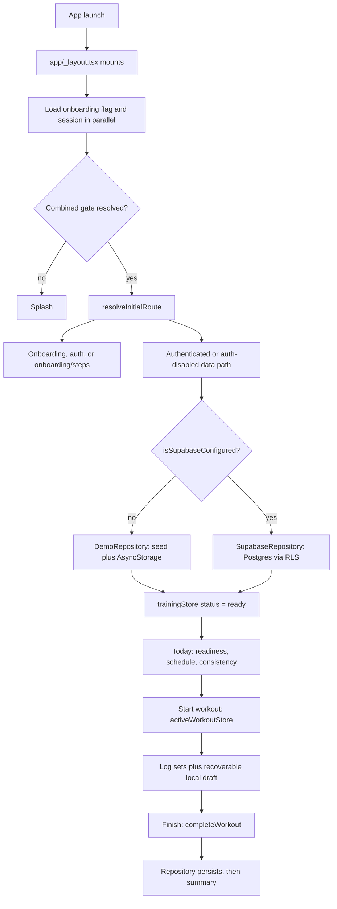

# PRism Architecture

## Document Status

- **Status:** Draft for review
- **Date:** 2026-07-25
- **Repository commit reviewed:** `2490c8de94b6492c2c20a3a91299313c30042320` (branch `main`, working tree clean, no staged/unstaged changes at time of review — verified via `git status`).
- **Current baseline (2026-07-29):** `main` is at `c59cbdb12d8ba2374d4d22ad6a9f8e0b91481fcb`. Everything merged between the reviewed commit and that baseline was documentation-only (product-intent-and-guardrails, architecture-baseline-audit, readiness-inputs-and-confidence-foundation planning); no code, schema, or test changed, so this document's findings held up to that point. **The `readiness-inputs-and-confidence-foundation` implementation sprint then changed code**: the check-in path, `src/domain/types.ts`, and `src/domain/calc/readiness.ts` no longer match this document's description of them. Findings touching those files are superseded by that sprint and by `Docs/invariants.md` I-7 and I-18; the rest of this document was not re-verified from 2026-07-29 to 2026-08-01.
- **Delta since the 2026-08-01 refresh (recorded 2026-08-03, not a full re-verification):** two
  feature sprints have landed on top of that baseline. `workout-session-continuity-v1`
  (2026-08-02) added the `workout/templates` route and local active-workout draft recovery;
  `workout-history-v1` (2026-08-03) added the `history`/`history/[id]` routes, the pure
  `src/domain/history.ts` derivation layer, and entry points from Today and Insights. Neither
  touched `src/data/repository.ts`, the stores' data contracts, or `supabase/migrations/`, so this
  document's Data Architecture, Security and Known Gaps sections are unchanged by them — G-1 (no
  auth path) and G-2 (non-atomic `saveWorkout`) both remain open. The route map below and the test
  counts are updated inline; nothing else in this document was re-verified on 2026-08-03. Current
  suite: **153 tests, 12 suites** (`npm test -- --ci`), typecheck clean. A third sprint,
  `today-insights-cohesion` (2026-08-03), then changed presentation only on those two screens —
  no data-layer, schema or store change — and added `src/content/deeperSurfaces.ts` as the single
  source of truth for the Progress/Body/History navigation row both screens render. Suite after it:
  **163 tests, 13 suites**, typecheck clean. A fourth, `logger-ux-polish` (2026-08-04), then
  polished the workout logger — confirmations in front of the two destructive removals, one shared
  set-type vocabulary in `src/content/setTypes.ts`, and the header metric relabelled "Sets done" so
  it stops colliding with the summary's warm-up-excluding "Working sets". Again presentation only:
  no data-layer, schema or store-contract change. Suite after it: **177 tests, 14 suites**,
  typecheck clean.
- **Baseline refresh (2026-08-01):** Re-verified against `main` after the `rls-policy-verification` → `rls-migration-fix` → `dependency-hygiene` → `cleanup-batch` sprint sequence (a pre-feature-readiness closure pass — see `Docs/readiness/2026-07-31-closure-inventory.md`). Commands re-run this session: `npm run typecheck` (clean), `npm test -- --ci` (**103/103 passed, 9 suites** — up from the 40/40, 1-suite baseline below), `npx expo-doctor` (**20/20**), `npm audit` (**11 moderate**, down from an unrecorded-here 36; the 1 high finding is fixed, the 11 moderate are confirmed unfixable short of a major, breaking Expo downgrade — see `Docs/sprints/2026-08-01-dependency-hygiene.md`). Material changes since 2026-07-29, superseding specific claims below where noted inline: (1) both security sprints landed (Keychain session storage, CSPRNG ids, server-derived write ownership, migration `0002_security_hardening.sql`); (2) the RLS migration defect is **fixed** — `supabase/migrations/0001_init.sql` now applies cleanly and 57/57 cross-tenant isolation assertions pass against the actual committed file (`Docs/sprints/2026-08-01-rls-migration-fix.md`), closing `Docs/invariants.md` I-1; (3) the UI was restructured to a five-tab bar (Today/Exercises/Insights/Social/Plans) with an onboarding flow, and all seven data-driven screens now share a loading/error/empty-state primitive (`ScreenState`); (4) a brand icon/splash asset pipeline (`assets/brand/`, `scripts/generate-app-icons.sh`) was added, including an Android Themed-Icons monochrome layer; (5) `react-hook-form`/`zod`/`@hookform/resolvers` were removed (previously unused); (6) the unreachable `CheckIn.note` field and the dead `Stepper.tsx` component were removed. This document's Known Gaps table is updated inline below rather than restating findings that no longer hold.
- **Delta since 2026-08-06 (`feature/v1-auth-and-session`, commit `0af00cd`):** **G-1 is closed in the
  client.** An authentication path now exists end to end — session state (`src/store/sessionStore.ts`),
  a combined onboarding+session route gate driven by a pure function (`src/domain/routing.ts`), a real
  sign-in/sign-up surface (`app/auth/index.tsx`), and an ordered sign-out teardown
  (`src/store/authActions.ts`). This is the first sprint since the baseline to change the **startup
  sequence itself**, so Runtime Architecture §1, §3, §4 and §7 are rewritten rather than annotated, as
  is the Security section's authentication-status paragraph. `SupabaseRepository.uid()` now reads
  `auth.getSession()` instead of `auth.getUser()` and throws a typed `AuthRequiredError`. Evidence:
  **287 tests, 20 suites** (`npx jest`), `npx tsc --noEmit` clean. `npm run test:integration` remains
  **1 suite / 5 tests skipped** — it is gated on `PRISM_INTEGRATION_SUPABASE_*` and no credentials were
  created, so **nothing in this sprint was exercised against a live Supabase project**. No schema, no
  migration, and no Supabase project setting changed: `supabase/migrations/` is untouched and the
  57-assertion RLS suite is unchanged. **I-2 and I-10 remain open**, and this sprint neither advanced
  nor was blocked by either. Full record: `Docs/sprints/2026-08-06-auth-and-session.md` and
  `Docs/decisions/ADR-0004-authentication-and-session.md`.
- **Delta since 2026-08-08 (`feature/v1-signout-surface`, commit `0029a7f`, based on `d8c206d`):** the
  sign-out teardown that shipped unreachable on 2026-08-06 now has a surface. Today's header carries an
  Account control (`Screen`'s previously-unused `headerRight` slot), gated by the pure
  `canOfferSignOut`; it opens `app/account.tsx`, a modal with identity, one explanatory sentence, and a
  "Sign out" row. `SessionUser` gained `email` and it was propagated through `getCurrentUser`,
  `signInWithPassword`, `signUpWithPassword` and `subscribeToAuthState` so identity does not depend on
  how the session was obtained. `src/store/authActions.ts` was **not** modified — this sprint made the
  teardown reachable, not different. Evidence: **312 tests, 22 suites**, `npx tsc --noEmit` clean,
  integration lane still 5 skipped. No schema, migration, or Supabase project setting changed. **I-2 and
  I-10 remain open**, and no password reset or deep-link capture was implemented. Full record:
  `Docs/sprints/2026-08-08-signout-surface.md`.
- **Delta since 2026-08-09 (`feature/v1-password-reset`, commit `954d075`, based on `eb2873f`):**
  password reset exists, closing the supportability gap the sign-out sprint left named in
  `Docs/production-posture-v1.md` §7. It is **code-based**: `resetPasswordForEmail` with no
  `redirectTo`, then `verifyOtp({ type: 'recovery' })` → `updateUser({ password })` → `signOut()`. The
  emailed link is not used, because using it would require the deep-link capture this repository does
  not have. New: `src/domain/authReset.ts` (stage machine and field rules, pure);
  `requestPasswordReset`/`confirmPasswordReset`; `AuthFailure` gains `resetSent` and `invalidCode`, and
  `toAuthFailure` gains an optional context so a rejected password and a rejected code — both 4xx — get
  different sentences. Reset is a **mode inside `app/auth/index.tsx`**, not a route: the route map is
  unchanged. Evidence: **367 tests, 24 suites**, `npx tsc --noEmit` clean, integration lane still 5
  skipped. No schema, migration, or Supabase project setting changed. **I-2 and I-10 remain open**;
  reset changes a credential and deletes nothing. Full record:
  `Docs/sprints/2026-08-09-password-reset.md`.
- **Delta since 2026-08-06 (`feature/v1-workout-write-integrity`, based on `7d89bf1` with `main` merged in):**
  **G-2 is closed**, and this entry also corrects four claims elsewhere in this document that had gone
  stale without anyone noticing — which is the more important half of the sprint, because this document
  is what `CLAUDE.md` tells every agent to trust over the code.
  - *The gap itself.* `supabase/migrations/0003_workout_write_integrity.sql` adds
    `save_workout_graph(jsonb, jsonb)`, a **`security invoker`** plpgsql function that writes the
    workout, its exercise blocks, its sets, and the personal records the session set — in one
    transaction. It is authoritative over the payload, so children the payload omits are deleted
    (the write was previously additive only, and a removed exercise came back on the next read).
    `personal_records` gains a `(profile_id, workout_id, exercise_id, kind)` unique index, making
    record persistence idempotent under retry. The positional unique constraints on
    `workout_exercises` and `sets` become `deferrable initially deferred` so a re-index inside one
    statement cannot transiently collide. `SupabaseRepository.saveWorkout` and the new
    `completeWorkout` both go through it.
  - *Verified against a live database, not asserted.* `supabase/tests/rls/03_run_write_integrity_tests.sql`
    (31 assertions) runs the mid-sequence-failure case I-2 names, plus reconciliation, retry
    idempotency, reordering, cross-tenant rejection and the unauthenticated case. Against a
    disposable local Postgres 16.14: **57/57 RLS + 31/31 write-integrity, from a clean database.**
    The suite caught a real defect in the migration during development — a cross-tenant write
    succeeded silently instead of erroring — which is now an explicit `42501`.
  - *Corrections made inline below, each marked `Corrected 2026-08-06`:* the `src/store`
    responsibility entry and the **Active workout** glossary entry both claimed an in-progress
    session "is not persisted until `finish()`" (untrue since session-continuity); the **Tests**
    entry claimed tests existed "only for `src/domain/calc`" (untrue for several sprints); the
    component-layer entry stated an absolute no-stores rule that two components already break.
  - *Also in this sprint:* draft writes are queued and revision-checked
    (`src/store/activeWorkoutStore.ts`), closing a data-loss race where an older `AsyncStorage`
    write could land after a newer one — or after a `discard()`, resurrecting a thrown-away session.
    `Docs/release-checklist.md` §3 is corrected; it stated the **opposite** of the current
    demo-mode default and would have led a release operator to expect a demo build.
  - Evidence: **375 tests, 24 suites** (`npx jest --ci`), `npx tsc --noEmit` clean. Integration lane
    unchanged (still gated, still skipped) — **nothing here was exercised against a live Supabase
    project**, only against local Postgres. **I-10 remains open.** Full record:
    `Docs/sprints/2026-08-06-v1-workout-write-integrity.md`.
- **Delta since 2026-08-07 (`feature/v1-staging-supabase-verification`, based on `main` at `a72a2e5`):**
  the integration lane is real code rather than four `it.todo`s, and **nothing in this document's
  "verified" claims about the database changes as a result** — because the lane has not been run.
  What exists now: a harness that boots PRism's own module graph against a staging project
  (`src/data/supabase/__tests__/support/`), 19 tests across auth lifecycle, repository/RPC behaviour,
  RLS between two real accounts, and account deletion, and a separate nightly/dispatch workflow
  (`.github/workflows/integration.yml`) that warns rather than passes when no project is configured.
  Evidence: `npx tsc --noEmit` clean; `npm test -- --ci` **401/25, unchanged**, confirming the
  hermetic lane is untouched; `npm run test:integration` **19 skipped, 0 failures**. **No Supabase
  project was created and no migration was applied anywhere** — creating one is owner-only
  (`Docs/invariants.md` I-4), and the runbook is §4 of the sprint record.
  Two findings that did not need a project to establish, both recorded there in full: **F-1** — no
  migration seeds `exercises` or `routines`, and `EXERCISE_LIBRARY`/`ROUTINE_TEMPLATES` are consumed
  only by `DemoRepository`, so a correctly migrated production project gives a real lifter an empty
  exercise picker and no plans (a v1 blocker, invisible to every existing suite, now pinned by a test);
  **F-2** — an access token survives both sign-out and account deletion, because it is a stateless JWT,
  so the security property is "discarded and unrenewable", not "revoked". Full record:
  `Docs/sprints/2026-08-07-staging-supabase-verification.md`.
- **Delta since 2026-08-07 (`feature/v1-library-seed`, cut from the integration branch above):**
  **F-1 is closed.** `supabase/migrations/0006_seed_library.sql` seeds the 43-movement catalogue and
  both template plans (2 routines, 7 days, 38 slots) as system rows (`profile_id = null`), so a real
  account finally has something to log against. It seeds **no training history of any kind** — that
  property is asserted in both SQL and TypeScript, because it is the product decision itself
  `[decision, engineer/owner, 2026-08-07]`: fabricated history is user data that is not the user's,
  the catalogue is app content. Ids are not pinned (nothing in application code references one) and
  idempotency is asserted as "no duplicate rows" rather than as a total, which survives
  `01_seed_test_data.sql`'s own system fixture. Evidence: `supabase/tests/rls/run.sh` against a clean
  local Postgres **16.14** — **146/146 assertions** (57 + 31 + 23 + 21 + **14 new**), reproduced twice
  from a freshly created database, with `0006` deliberately applied twice by the runner; plus 47
  drift-guard tests (`src/data/__tests__/librarySeed.test.ts`) pinning the migration to
  `EXERCISE_LIBRARY`/`ROUTINE_TEMPLATES` in both directions. `eas.json`'s `preview` profile is flipped
  to `EXPO_PUBLIC_DEMO_MODE: "false"`. **Two things this does not mean:** `0006` has run against a
  disposable local database only and no hosted project has it; and a preview build cut today shows
  `SUPABASE_MISCONFIGURED_MESSAGE` rather than the app, because the EAS `preview` environment still
  has no Supabase variables. A second, separate gap remains open and is now the binding one for
  testers — **there is still no way to create an exercise anywhere in the app** (`Repository` has no
  exercise write methods; `activeWorkoutStore.addExercise` only attaches an existing one), so a lifter
  is limited to the seeded 43. Full record: `Docs/sprints/2026-08-07-library-seed.md`.
- **Live staging follow-up (2026-08-08)** `[fact, engineer/owner handoff]`: the qualification in the
  two entries above is now superseded as a statement about current state. A staging Supabase project
  exists with migrations `0001`–`0007` applied. `npm run test:integration` passed **19/19** against
  that project locally and in the separate `Integration (staging Supabase)` GitHub Actions workflow;
  `supabase/tests/rls/run.sh` remains **154/154** against clean local Postgres 16.14. A cold-started
  simulator also completed sign-up → setup questions → Today → account deletion against staging.
  This is staging evidence, not production evidence: no production project is claimed here.
- **Delta since 2026-08-08 (`0007_deletable_account_with_custom_exercises.sql`, landed in PR #57):**
  account deletion had been impossible when a lifter's own custom exercise was still referenced by
  one of their workout or routine rows. The two exercise foreign keys now use `on delete no action
  deferrable initially deferred`: deleting a referenced movement by itself is still refused, while an
  account-wide cascade can remove both branches before the constraint is checked. The case escaped
  the local deletion suite because `05_run_account_deletion_tests.sql` creates a workout with no
  exercise blocks. Eight assertions in `07_run_exercise_reference_tests.sql` close that hole; the
  full local SQL result is **154/154**, and the staging integration lane returned to **19/19** after
  `0007` was applied. Full record: `Docs/sprints/2026-08-08-account-deletion-fk-fix.md`.
- **Delta since 2026-08-08 (`feature/v1-first-run-routing`, PR #58, open at `dc31412`):** a new install
  on a real-backend build could reach neither sign-up nor sign-in: the first-run gate treated the root
  `auth` segment as an escape from onboarding and bounced it to the welcome screen. `/auth` is now a
  legal first-run destination while the build is unauthenticated; after authentication the gate sends
  the lifter to `ONBOARDING_STEPS_ROUTE` (`/onboarding/steps`) so the setup questions are not stranded.
  `app/auth/index.tsx` no longer issues its own post-auth redirect, leaving one routing authority. The
  same PR splits the completion sentence by backend so a real account is no longer told it has sample
  history or device-only storage. Evidence: **456 tests / 26 suites**, typecheck clean, and the full
  first-run path repeated on a wiped, cold-started simulator against staging. Full record:
  `Docs/sprints/2026-08-08-first-run-routing-fix.md`.
- **Branch provenance note `[fact, 2026-08-06, still true 2026-08-09]`:** at the time of writing, `main` is at `ecfd1f1` and
  contains **none** of the production-posture commit (`5c18d93`), the auth work (`0af00cd`), the
  guardrail docs (`d8c206d`), the sign-out surface (`0029a7f`) or password reset (`954d075`). All five
  sit on their own branches, unmerged, each based on the one before it. Claims in this document
  describing auth, sign-out, reset or the demo-fallback throw are claims about that branch chain, not
  about `main`.
- **Scope:** A read-only, evidence-based inventory of the current state of the PRism repository — code, schema, tests, CI, and configuration as they exist today.
- **Non-goals:** This document does not propose a future architecture, does not create new process documents (invariants, ADRs, product intent), and does not evaluate anything outside this repository (App Store/Play listing, backend infrastructure beyond the committed SQL migration, third-party services). It is not a design review of the visual/UX system beyond what is verifiable from code.

---

## Executive Summary

**What is currently working (verified):**
- The app boots, typechecks, and passes its current hermetic suite with zero errors: **456 tests / 26
  suites** (`npm run verify`, 2026-08-08). The original 2026-08-01 baseline was 103/103 across 9 suites.
- **RLS policies and the app's own Supabase module graph are now demonstrated against staging, not
  just written.** The local SQL runner passes **154/154** against the seven committed migrations, and
  the credential-gated staging lane passes **19/19** across auth, repository/RPC behaviour, cross-user
  isolation, export and deletion. This is not evidence about a production project.
- A complete **demo mode** runs the entire app on deterministic, locally generated data with zero network calls and zero configuration (`src/data/demoSeed.ts`, `src/data/repository.ts`).
- A pure, thoroughly unit-tested **calculation engine** (`src/domain/calc/`) implements 1RM estimation, volume, PR detection, recovery estimation, a composite readiness score, and next-load recommendations.
- A **Supabase/Postgres schema** with row-level security exists and is checked into the repo (`supabase/migrations/0001_init.sql`), covering 11 tables and a consistent ownership model.
- One full user workflow — start a session, log sets, finish, see a summary — is implemented end-to-end
  in both repositories. The Supabase implementation is exercised through the app's repository graph in
  the staging integration lane; the cold-started device path has additionally covered sign-up, setup,
  Today and account deletion.

**What is demo-only, mocked, partial, or unknown:**
- ~~The Supabase path had no live execution evidence, integration job, or auth UI.~~ **Resolved for
  staging 2026-08-08:** the 19-test integration lane and cold-started first-run path above exercise it.
  Production remains unverified, and the recovery-email token-template edit remains owner-side and
  unverified.
- Tabs **Progress, Body, Insights, and Plans** are explicitly labelled in-code and in the README as partial: each renders real calculations today but ships a `PhasePanel` describing unbuilt future scope (interactive charts, SVG body map, recommendation engine, plan editor).
- The default CI jobs remain hermetic; a separate nightly/dispatch integration workflow exercises the
  staging project when its two `PRISM_INTEGRATION_*` values are configured.
- Native `ios/` and `android/` directories are git-ignored and regenerated locally via `expo prebuild` — this repository's tracked source is the Expo-managed layer only.

**Five most material architecture / launch risks (updated 2026-08-01):**
1. ~~**No authentication path exists.**~~ **Resolved in the client and on staging.** The remaining auth
   gaps are narrower: the recovery-email `{{ .Token }}` template change is owner-side and unverified,
   and deep-link session capture does not exist.
2. ~~**Multi-record workout writes are still not atomic.**~~ **Resolved and exercised on staging.**
   `save_workout_graph` is a single `security invoker` transaction with reconciliation and retry
   idempotency. Production application remains unverified.
3. **No observability** — no crash reporting, analytics, or logging pipeline was found in dependencies or source. **Unchanged.**
4. **Release tooling is partial** — `eas.json` exists and `preview` is a real-backend profile, but no EAS
   build has proved it and the `preview` environment still needs its two Supabase variables (G-7).
5. **Residual dependency vulnerabilities** — `npm audit` reports 11 moderate findings, all transitive through `xcode`/`@expo/config-plugins` (`expo prebuild`-time tooling, not shipped in the app bundle). Confirmed unfixable without a major, breaking Expo downgrade; tracked as accepted risk pending an upstream fix (`Docs/sprints/2026-08-01-dependency-hygiene.md`).

~~Previously listed here, now resolved:~~ *RLS policies and the schema are unexercised* — **resolved 2026-08-01**, see above. *Unused dependencies present* (`react-hook-form`, `zod`, `@hookform/resolvers`) — **resolved 2026-08-01**, all three removed (confirmed zero imports before removal).

**This is an evidence-based current-state document, not a future-state design.** Every claim below is either marked *verified* (backed by a specific file, command output, or test), *inferred* (a reasonable reading of code that was not directly executed), or *unknown* (cannot be determined from this repository and requires confirmation).

---

## Product and System Boundaries

**Intended user outcome and core workflow** (source: `README.md`): PRism is a strength-training and workout-tracking app for intermediate lifters training 3–6 days/week. The core loop, as implemented, is: see today's readiness and scheduled session (Today tab) → start and log a workout set-by-set (Workout logger) → review a post-session summary with PRs and volume (Workout summary). Every derived number (readiness, recovery, load suggestions) ships with a plain-language rationale rather than being presented as an unexplained verdict — this is a stated design principle in the README and is verifiably implemented (`READINESS_EXPLANATION`, `RECOVERY_MODEL_EXPLANATION`, `LoadSuggestion.rationale`).

**In-scope platforms** (verified, `app.json` + `package.json`): iOS (`ios.bundleIdentifier: app.prism.trainer`, `supportsTablet: false`), Android (`android.package: app.prism.trainer`), and web (`web.bundler: metro`, `web.output: single`, plus `react-native-web` dependency and an `npm run web` script). No platform-specific code branches beyond a few `Platform.OS` checks in styling (e.g. `app/(tabs)/_layout.tsx`) were found.

**Explicit originality boundary for Liftly reference material:** The README's "Originality" section (`README.md`, final section) states in-repo that the design system, copy, exercise library, coaching cues, template plans, calculation model, and every UI component were written from scratch, and that Epley's formula, volume-as-weight-×-reps, and the acute:chronic ratio are cited as standard, public-domain strength-training mathematics rather than borrowed proprietary content. This document does not independently verify originality against any external product — that determination is out of scope for a code-only audit and is recorded here only as the stated project position.

**What this repository does and does not currently implement:**
- **Implements:** demo-mode data layer, calculation engine, Today/Workout logger/Exercise picker/Workout summary screens, Supabase schema + RLS (as SQL), a typed repository abstraction, design token system, Jest suite for the calc engine, CI for typecheck+test.
- **Does not implement (verified absent):** authentication screens, onboarding flow, settings screen, data export/delete UI (the README lists these as Phase 6 / "planned"), push notifications, analytics/crash reporting, EAS build configuration, any server-side code beyond the SQL migration, offline-queue/sync logic for the Supabase path.

---

## Technology Inventory

| Concern | Technology / Package | Version (verified) | Responsibility | Evidence |
|---|---|---|---|---|
| Framework | Expo | `^57.0.8` | Managed native runtime, build tooling | `package.json` |
| Mobile runtime | React Native | `0.86.0` | Cross-platform native rendering | `package.json` |
| UI library | React / React DOM | `19.2.3` | Component model | `package.json` |
| Language | TypeScript | `~6.0.3`, `strict: true` | Static typing across app/src | `package.json`, `tsconfig.json` |
| Routing | Expo Router | `~57.0.8` | File-based navigation, typed routes (`experiments.typedRoutes: true`) | `package.json`, `app.json` |
| State management | Zustand | `^5.0.3` | Two stores: persisted training data, ephemeral active-workout session | `package.json`, `src/store/*.ts` |
| Backend / data | Supabase (`@supabase/supabase-js`) | `^2.48.1` | Postgres + auth + RLS backend, optional (demo mode is default) | `package.json`, `src/data/supabase/client.ts` |
| Local persistence | `@react-native-async-storage/async-storage` | `2.2.0` | Demo-mode local writes; Supabase session storage | `src/data/repository.ts`, `src/data/supabase/client.ts` |
| Auth | Supabase Auth (client SDK only) | `^2.48.1` | `auth.getUser()` used to scope queries; **no sign-in/out UI exists** | `src/data/repository.ts` (`SupabaseRepository.uid()`) |
| Forms | *(removed 2026-08-01)* | — | `react-hook-form`, `@hookform/resolvers`, `zod` were declared but never imported anywhere in `app/` or `src/`; removed as dead weight (`Docs/sprints/2026-08-01-dependency-hygiene.md`). Auth and check-in forms use hand-rolled validation instead. | `git log` |
| Testing | Jest `^29.7.0` + `jest-expo` `~57.0.2` | — | Unit tests for `src/domain/calc` | `package.json`, `src/domain/calc/__tests__/calc.test.ts` |
| CI | GitHub Actions | — | Typecheck + test on push/PR to `main` | `.github/workflows/ci.yml` |
| Build / release | Expo CLI (`expo run:ios`/`run:android`), no EAS config | — | Local native builds only; no `eas.json` found in repo | `package.json` scripts; absence confirmed via file search |
| Environment config | `EXPO_PUBLIC_*` vars, inlined at build time | — | Demo-mode toggle + Supabase URL/anon key | `.env.example`, `src/data/supabase/client.ts` |
| Icons | `@expo/vector-icons` | `^15.0.2` | Ionicons used throughout tab bar and UI | `package.json`, `app/(tabs)/_layout.tsx` |
| Gestures/safe area | `react-native-gesture-handler` `~2.32.0`, `react-native-safe-area-context` `~5.7.0`, `react-native-screens` `~4.26.0` | — | Navigation plumbing required by Expo Router | `package.json`, `app/_layout.tsx` |
| Graphics | `react-native-svg` `15.15.4` | — | Present but no SVG component found in `src/components` yet (Phase 3 body map is "planned") | `package.json` |
| Haptics | `expo-haptics` `~57.0.1` | — | Feedback on set completion | `src/store/activeWorkoutStore.ts` |
| Keep-awake | `expo-keep-awake` `~57.0.1` | — | Prevents device sleep during a logged session | `app/workout/active.tsx` |

---

## Repository Map

```
prism/
├── app/                     # Expo Router — file-based routes only
│   ├── _layout.tsx          # Root stack: gesture root, safe area, data bootstrap
│   ├── (tabs)/               # Tab navigator: index, progress, body, insights, plans
│   └── workout/               # Modal/stack routes: active, picker, summary
├── src/
│   ├── theme/                # Design tokens: colour, spacing, radius, typography
│   ├── components/
│   │   ├── ui/                 # Primitives (Button, Card, Text, Screen, ...)
│   │   ├── today/               # Today-tab composite components
│   │   └── workout/              # Logger composite components
│   ├── domain/                # Pure logic — no React, no I/O (types, muscles,
│   │   │                       # schedule, calc/*) — enforced by convention, not lint
│   │   └── calc/                # oneRepMax, volume, prs, recovery, readiness,
│   │                            # loadRecommendation, __tests__/
│   ├── data/                  # Repository interface + demo & Supabase impls,
│   │   │                       # exercise library, routine templates, demo seed
│   │   └── supabase/             # client.ts (lazy client), mappers.ts (snake<->camel)
│   ├── store/                 # trainingStore (persisted read model),
│   │                          # activeWorkoutStore (ephemeral session state)
│   └── utils/                 # format.ts, id.ts
├── supabase/migrations/       # 0001_init.sql — schema + RLS, single migration
├── .github/workflows/ci.yml   # Typecheck + test on push/PR
├── ios/, android/             # Git-ignored, regenerated via `expo prebuild`
└── package.json / tsconfig.json / app.json / .env.example
```

**Additions since 2026-07-25, not reflected in the tree above (kept as originally drawn rather than
redrawn wholesale, to avoid introducing new unverified claims into a diagram):**
- `app/(tabs)/` gained `exercises.tsx` and `social.tsx`; the tab bar is five destinations
  (Today/Exercises/Insights/Social/Plans), with Progress and Body still routable but hidden from the
  bar (`href: null`).
- `app/onboarding/` — a first-run flow (splash, welcome, feature carousel, presentation-only auth,
  four-step setup, completion), gating first launch via a persisted flag in `app/_layout.tsx`.
- `assets/brand/` — the brand icon/splash source artwork and four generated derivatives (app icon,
  adaptive icon, splash icon, Android monochrome icon), plus `scripts/generate-app-icons.sh` and two
  Python helpers (`alpha-key.py`, `monochrome-key.py`), all deterministic/reproducible from the
  committed source.
- `supabase/migrations/0002_security_hardening.sql` — a second migration (`display_name` bounding, a
  cross-tenant exercise-visibility trigger), applied and verified in this repository as of 2026-08-01.
- `supabase/tests/rls/` — the RLS isolation test suite (57 SQL assertions + a runner script), not
  wired into CI.
- `src/store/onboardingStore.ts` — onboarding's local, `AsyncStorage`-only draft state.
- `src/components/ui/ScreenState.tsx` — the shared loading/error/empty-state primitive all seven
  data-driven screens now use.
- `src/content/` — user-facing copy held outside the screens that render it (`onboarding.ts`,
  `social.ts`; `deeperSurfaces.ts`, added 2026-08-03, the single source of truth for the
  Progress/Body/History navigation row that both Today and Insights draw from; and `setTypes.ts`,
  added 2026-08-04, the one set-type vocabulary shared by the logger and History).
- `src/domain/history.ts` + `app/history/` — the Workout History v1 derivation layer and its two
  screens (added 2026-08-03).

**Responsibility and dependency direction (verified by import inspection):**

- **`app/` (routes/screens):** Thin composition layer. Reads from `useTrainingStore` / `useActiveWorkoutStore`, calls `src/domain/calc` selectors, and renders `src/components`. No screen talks to `src/data` directly except via the stores.
- **`src/components/ui` and `src/components/{today,workout}`:** Presentational by default — data and callbacks arrive as props, and styling comes from `src/theme`. **Corrected 2026-08-06** `[fact]`: the rule was previously stated as absolute ("do not call the repository or stores directly"), qualified only by "verified for the files read". An exhaustive grep of `src/components/` for `useTrainingStore|useActiveWorkoutStore|useSessionStore|getRepository` finds **two** standing exceptions, and no others: `today/CheckInPrompt.tsx` subscribes to `useTrainingStore` and calls `saveCheckIn` itself, and `workout/RestTimerBar.tsx` reads `restTimer` and calls `adjustRest`/`clearRest` on `useActiveWorkoutStore`. **No component reaches `src/data` directly.** Treat the boundary as **"components never touch the repository; two container-like components do touch stores"** — and prefer lifting new store access to the screen rather than lengthening that list.
- **`src/domain` (business logic):** Pure functions and types. `src/domain/types.ts` documents itself as mirroring the SQL schema one-to-one. The README states the rule "`src/domain` never imports from `src/components`, `app/`, or `src/data`" — confirmed for every file read (`schedule.ts`, `readiness.ts`, `volume.ts`, `oneRepMax.ts`); no lint rule enforces this, so it is a convention, not a guarantee.
- **`src/store` (application/state):** `trainingStore` is a read model populated by the `Repository`; it holds no calculation logic itself and delegates all derived values to `src/domain/calc`. `activeWorkoutStore` is deliberately separate, and holds the in-progress session. **Corrected 2026-08-06** `[fact]`: this entry previously said an in-progress session "is not persisted until `finish()`". That has not been true since the session-continuity sprint. There are **two distinct persistence layers**, and conflating them is how a reader concludes a process kill always loses the session:
  - *Local draft* — every mutation mirrors `workout` to `AsyncStorage` under `prism.activeWorkout.draft.v1`, so a killed process can recover it on relaunch (`hydrate()`, and the `subscribe` at the foot of the module). Writes are queued and revision-checked, so the newest state is the one that survives a kill and a discarded session cannot be resurrected by a stale write. This mirror is read by nothing except that `hydrate()`, is scoped to a `DraftOwner`, and is removed on sign-out (`src/store/authActions.ts`).
  - *Repository-backed workout* — only on `finish()`, when the completed workout goes to `trainingStore.completeWorkout` and through the repository. This is the only layer that reaches Postgres.
- **`src/data` (repositories/data access):** `repository.ts` defines the `Repository` interface and two implementations (`DemoRepository`, `SupabaseRepository`), selected once at module load via `getRepository()` based on `isSupabaseConfigured`. `supabase/client.ts` lazily constructs the Supabase client only when configured, so demo mode makes zero network calls.
- **Supabase/database:** Seven ordered migrations (`0001`–`0007`) define schema, transactional RPCs,
  partial check-ins, deletion, shared catalogue content and the deferred exercise-reference constraints.
  The local/CI SQL runner applies all seven to disposable Postgres; applying them to a hosted project
  remains an owner-run operation documented in the README and staging runbook.
- **Tests:** **Corrected 2026-08-08** `[fact, `npm run verify`]`. This entry once claimed tests existed
  only for `src/domain/calc`. Actual hermetic coverage today is **26 suites, 456 tests**, across
  `src/content`, `src/data`, `src/domain`, `src/store` and `src/utils`. A separate **19-test** integration
  lane drives the app's Supabase module graph against staging. Still genuinely untested: rendering under
  **anything in `app/` or `src/components`** — there is no component/screen test framework.
- **Configuration/build/CI:** `app.json` (Expo config), `eas.json` (development/preview/production
  profiles), `tsconfig.json` (strict TS), `.env.example` (three `EXPO_PUBLIC_*` names), default hermetic
  CI in `.github/workflows/ci.yml`, and the separate credential-gated staging workflow in
  `.github/workflows/integration.yml`.

---

## Runtime Architecture

**1. App startup and route entry** *(verified, `app/_layout.tsx`)*
Expo Router's entry point (`expo-router/entry`, `package.json` → `main`) mounts `app/_layout.tsx` as the root layout. It wraps the app in `GestureHandlerRootView` and `SafeAreaProvider`, sets the status bar, and defines a `Stack` whose top-level routes are `(tabs)` (the tab group), `auth/index` (sign-in/sign-up, gestures disabled), `account` (modal, added 2026-08-08), `onboarding`, `workout/active` (slide-from-bottom, gestures disabled), `workout/picker` and `workout/templates` (modals), `workout/summary`, and the two `history` routes.

**Rewritten 2026-08-06 (`feature/v1-auth-and-session`).** The root layout previously ran two things on mount — an unconditional `trainingStore.load()` and a redirect effect that knew only about onboarding — and held the splash until the persisted onboarding flag resolved. It now holds **one combined gate**. `sessionStore.initialize()` and `onboardingStore.load()` both fire on mount and are allowed to race, because each only reads local storage and neither redirects; `Splash` renders until `sessionPhase !== 'unknown' && onboardingStatus === 'ready'`. Adding a second condition to the old shape would have meant two effects redirecting off the same `useSegments()` array, which is how a gate turns into a redirect loop.

A **single** effect then calls `resolveInitialRoute({ onboardingCompleted, sessionPhase,
currentSegment })` (`src/domain/routing.ts`) and redirects only on a non-null result; returning `null`
when already at the destination is the loop guard, asserted as a stability property in
`src/domain/__tests__/routing.test.ts`.

**Rewritten 2026-08-08 (`feature/v1-first-run-routing`).** First run still takes precedence, but its
account step is now modelled explicitly. While onboarding is incomplete, the `onboarding` segment is
stable; `/auth` is also stable when the phase is `'unauthenticated'`, because sign-in/sign-up is a step
inside the credentialed first run even though its route now lives at the root. When that step produces
an `'authenticated'` phase, the gate routes to `ONBOARDING_STEPS_ROUTE` (`/onboarding/steps`) so the
remaining setup questions are not skipped. A `'disabled'` build never treats `/auth` as legal and
returns to onboarding because demo/misconfigured builds have no account to create. Once onboarding is
complete, `'unauthenticated'` routes to `/auth`; `'authenticated'` and `'disabled'` evict only the
`onboarding` and `auth` entry segments and otherwise leave the current route alone. `app/auth/index.tsx`
does not redirect on success — the phase transition is the single signal and the gate is the single
authority. The rule remains pure because this repository has no component-render test tooling.

**2. Environment / configuration loading** *(verified, `src/data/supabase/client.ts`)*
`EXPO_PUBLIC_DEMO_MODE`, `EXPO_PUBLIC_SUPABASE_URL`, and `EXPO_PUBLIC_SUPABASE_ANON_KEY` are read from `process.env` at module load (inlined into the bundle at build time by Expo's `EXPO_PUBLIC_` convention — not runtime-configurable post-build). No `.env` values are read by this audit; only variable names from `.env.example` are documented.

**3. Demo-mode vs. production-mode selection** *(verified, `src/data/repository.ts` + `src/data/supabase/client.ts`)*
`isSupabaseConfigured = !DEMO_MODE && url.length > 0 && anonKey.length > 0`. `getRepository()` is a lazily-initialized singleton: it constructs a `SupabaseRepository` if configured, otherwise a `DemoRepository`, and this decision is made once per app process (no runtime toggle). **Superseded 2026-08-06 (`feature/v1-production-posture`):** `DEMO_MODE` no longer defaults to `true` unconditionally. An unset `EXPO_PUBLIC_DEMO_MODE` now follows the build — `__DEV__` (Metro, Jest) means demo, any release bundle means real backend — and an explicit value still wins either way, so local "no backend needed" behaviour is unchanged. `getRepository()` also no longer falls back to `DemoRepository` when demo is off but credentials are missing: that combination now throws (surfaced as the normal `ScreenState` error via `trainingStore.refresh`'s try block), because silently downgrading a live-looking build to device-only storage is exactly the invisible data loss I-2/I-15 exist to prevent. Full posture, including the per-profile table and the G-1 blocker: `Docs/production-posture-v1.md`.

**Extended 2026-08-06 (`feature/v1-auth-and-session`).** Mode selection itself is unchanged; what is new is that repository *use* is now also gated on session state. `isAuthEnabled()` (`src/data/supabase/auth.ts`) returns `!DEMO_MODE && isSupabaseConfigured`, and `sessionStore.initialize()` reads it before anything else, which yields three startup states:

- **Demo** (`EXPO_PUBLIC_DEMO_MODE` truthy, or unset under `__DEV__` — Metro and Jest): phase resolves to `'disabled'` immediately. No Supabase client is constructed, no Keychain read occurs, and no network call is made. `DemoRepository` and the `DEMO_PROFILE_ID` literal are unchanged, and the onboarding account step is skipped entirely. Asserted by `src/data/__tests__/authPosture.test.ts`.
- **Misconfigured** (demo off, credentials absent): phase also resolves to `'disabled'` — deliberately. Routing this build to a sign-in screen would ask someone to type a password into a form that cannot work, while hiding the message that names the real problem. Resolving it to `'disabled'` instead lets startup proceed to `getRepository()`'s existing `SUPABASE_MISCONFIGURED_MESSAGE` throw, which still surfaces as the ordinary retryable `ScreenState` error. The auth gate must never be the thing that reports a configuration fault.
- **Configured** (demo off, credentials present): the phase is determined by the persisted Keychain session — `'authenticated'` or `'unauthenticated'`. `SupabaseRepository` is reached only in the former.

**4. Data retrieval and state updates** *(verified, `src/store/trainingStore.ts`)*
`load()` guards against re-entry (`if status is 'loading' or 'ready', return`) and delegates to `refresh()`, which sets `status: 'loading'`, fires eight repository calls in parallel via `Promise.all` (profile, exercises, routines, active routine, workouts, check-ins, measurements, personal records), and on success sets `status: 'ready'` with all data populated; on failure sets `status: 'error'` with a message. Screens key their loading/error UI off `status` (verified in `app/(tabs)/index.tsx`).

**Rewritten 2026-08-06 (`feature/v1-auth-and-session`).** This used to begin "`app/_layout.tsx` calls `load()` once on mount," and that is no longer true. Data loading waits for the session: a second effect keyed on `sessionPhase` calls `refresh()` when the phase is `'authenticated'` or `'disabled'`. Previously a real-backend build fired all eight calls before any session existed — six of them reach `uid()` — so the store landed in `status: 'error'` before the gate had decided the lifter should be looking at a sign-in screen. The same effect hydrates the local workout draft, passing a `DraftOwner` so a draft belonging to a different account, or to a prior demo run where the id is the `DEMO_PROFILE_ID` literal, is discarded rather than resumed.

`refresh()`'s catch now discriminates. An `AuthRequiredError` (`src/data/authRequired.ts`) sets `status: 'idle'` — **not** `'error'` — and calls `sessionStore.markUnauthenticated()`, which the route gate turns into a redirect. The `'idle'` choice is load-bearing rather than cosmetic: `load()`'s re-entry guard returns early on `'loading'`/`'ready'`, so leaving a stale status here would silently swallow the first load after a successful sign-in. Every other failure keeps the previous behaviour.

**5. Workout logging flow** *(verified, `src/store/activeWorkoutStore.ts` + `app/workout/active.tsx`)*
`activeWorkoutStore.start()` builds a `Workout` in memory, pre-populated with empty sets from the routine day's targets (or empty if an "open session"). All mutations (`updateSet`, `toggleSetComplete`, `addSet`, etc.) are synchronous, in-memory, and optimistic — nothing touches the repository until `finish()` is called. `finish()` strips any exercise with zero completed sets, stamps `endedAt`/`status: completed`, clears the active-workout store, and returns the finished `Workout`. The caller (`app/workout/active.tsx`, evidenced by import of `useTrainingStore`'s `upsertWorkout`) is responsible for calling `trainingStore.upsertWorkout(finished)`, which persists via `repo.saveWorkout()` and updates the read model. `toggleSetComplete` also fires a haptic and starts a rest timer.

**6. Calculation / insight flow** *(verified across `src/domain/calc/*.ts` and consuming screens)*
Screens do not store derived values — they call `src/domain/calc` functions inside `useMemo` on every render with the latest data from the stores. Example chain on the Today screen (`app/(tabs)/index.tsx`): `estimateRecovery()` → `computeReadiness()` → rendered by `ReadinessCard`; `volumeInWindow()` computes this-week vs. last-week volume for the consistency card. The same functions back Progress (`e1rmSeries`), Body (`estimateRecovery`), and Insights (`muscleDistribution`, `volumeInWindow`) screens — there is one calculation implementation reused across every surface, matching the README's "portable, testable in isolation" design goal.

**7. Error, loading, empty, and offline behavior**
- **Loading:** Verified — `TodayScreen` renders an `ActivityIndicator` while `status` is `'idle'`/`'loading'`.
- **Error:** Verified — `TodayScreen` renders a retry `Card` when `status === 'error'`, wired to `refresh()`. Other tabs (Progress, Body, Insights, Plans) were not observed to render a distinct error state; they consume `useTrainingStore` selectors directly and would render with empty/default data if `status` were `'error'`, since they do not branch on `status` (verified by reading each file — none references `s.status`). **This is a confirmed gap**, not an inference. *(Superseded by G-5's resolution: all seven data-driven screens now share `ScreenState`.)*
- **Error, auth vs. data (added 2026-08-06):** the two are now separated. "No session" is a routing event, not a load failure: it travels as `AuthRequiredError`, is caught by `refresh()`, and moves the session phase to `'unauthenticated'` so the gate redirects to sign-in. `ScreenState` is reserved for genuine data failures. This removes the case the previous design produced — "Could not load this" over the message *Not signed in.*, behind a Retry button that could never succeed, on a build with no route to a sign-in screen because none existed.
- **Empty:** Verified per-screen — Today shows "No plan is active yet..." when no session resolves; sections (fatigued muscles, recent PRs) are conditionally hidden when empty (`fatigued.length > 0`, `recentPrs.length > 0`).
- **Offline:** No offline-detection code was found (`NetInfo`, `isConnected`, or similar — searched across `app/` and `src/`, one unrelated match for the word "offline" in a comment in `src/theme/typography.ts`). Demo mode is inherently offline-capable since it never calls the network. The Supabase path's behavior when offline is **unknown** — `SupabaseRepository` calls will presumably reject and propagate an `Error` up to `trainingStore.refresh()`'s catch block, but this was not exercised by any test.



---

## Data Architecture

**Entities and relationships** *(verified, `supabase/migrations/0001_init.sql` and `src/domain/types.ts`, which the file's own header states mirrors the SQL 1:1)*:
`profiles` (1) → `workouts` (N) → `workout_exercises` (N) → `sets` (N); `profiles` → `routines` (N) → `routine_days` (N) → `routine_exercises` (N); `profiles` → `body_measurements`, `check_ins`, `personal_records` (N each); `exercises` is shared (system rows have `profile_id = null`) and referenced by `workout_exercises` and `routine_exercises`.

**Ownership and lifecycle:** Every user-owned row carries `profile_id`, and `profiles.id` references `auth.users(id) on delete cascade` — deleting the Supabase auth user cascades through the entire schema (verified in migration comments and FK definitions). A trigger (`handle_new_user`) auto-creates a `profiles` row on signup. In demo mode, there is no `auth.users` equivalent — `DemoRepository` uses a fixed `DEMO_PROFILE_ID` constant and persists only *user-logged* workouts/records/check-ins to `AsyncStorage` under fixed keys (`prism.demo.workouts.v1`, etc.); the seeded 8-week history is regenerated in memory each launch and merged with anything the user has logged.

**Demo data vs. Supabase data:** These are two structurally-identical but operationally distinct datasets behind one `Repository` interface (verified, `src/data/repository.ts`). Demo data has no expiry, sync, or multi-device concept — it is single-device, `AsyncStorage`-backed. A `resetDemoData()` function exists to wipe it back to the pristine seed.

**Repository abstraction and contracts:** The `Repository` interface (`src/data/repository.ts`) is the sole contract the UI depends on: `getProfile`, `updateProfile`, `listExercises`, `listRoutines`, `getActiveRoutine`, `listWorkouts`, `saveWorkout`, `deleteWorkout`, `listCheckIns`, `saveCheckIn`, `listMeasurements`, `listPersonalRecords`, `savePersonalRecords`. Both implementations satisfy it in full. `SupabaseRepository.saveWorkout` upserts the workout, its exercises, and its sets in three sequential calls (not a single transaction) — a partial failure mid-save (e.g. workout row succeeds, sets upsert fails) would leave Postgres in a partially-written state. This is a **confirmed code pattern**, not a confirmed production incident; no test exercises this path.

**Database migrations, RLS, and authorization posture:** One migration file, `0001_init.sql`, creates all tables, enums, indexes, the `updated_at` trigger, the `handle_new_user` trigger, and RLS policies for every table (`select`/`all` policies scoped to `auth.uid()`, with `exists`-walk policies for child tables lacking their own `profile_id`). No migration tooling (e.g. `supabase migration up`, a migrations runner script) was found in `package.json` — applying this file is a manual step per the README.

**Data integrity gaps or unknowns:**
- `saveWorkout`'s three-step upsert is not atomic (see above) — **likely risk**, unconfirmed by test.
- No automated verification that the RLS policies actually behave as written against a real Postgres instance — **unknown, requires validation** (e.g. via `supabase test db` or a CI job with a local Postgres container, neither of which exists in this repo).
- `exercises` table has a partial unique index (`lower(name), equipment) where profile_id is null`) preventing duplicate system exercises, but no equivalent constraint prevents a user from creating a duplicate personal exercise — **inferred, minor, not verified against runtime behavior**.

---

## Security and Privacy Posture

**Authentication/authorization implementation status:** ~~Client-side Supabase Auth SDK is wired (`getSupabase().auth.getUser()` in `src/data/repository.ts`), but **no sign-in, sign-up, sign-out, or session-recovery screen exists anywhere in `app/`**. Category: **confirmed issue**.~~ **Superseded 2026-08-06 (`feature/v1-auth-and-session`).**

A complete client-side authentication path now exists. `src/data/supabase/auth.ts` is the only module in the app that calls Supabase's auth API (`isAuthEnabled`, `getCurrentUser`, `signInWithPassword`, `signUpWithPassword`, `signOut`, `subscribeToAuthState`), which keeps `getSupabase()` — a function that throws on an unconfigured build — out of the store layer. `src/store/sessionStore.ts` owns a four-phase machine (`unknown` / `unauthenticated` / `authenticated` / `disabled`) and subscribes once, for the process lifetime, to `onAuthStateChange`; that subscription is what turns a revoked or permanently-unrefreshable token into a routing event rather than a mystery error on the next load. `app/auth/index.tsx` is a real sign-in/sign-up surface, and `app/onboarding/auth.tsx` is now a `<Redirect>` into it.

`SupabaseRepository.uid()` changed in two ways. It reads `auth.getSession()` rather than `auth.getUser()`: `getUser()` round-trips to `/auth/v1/user` on every call, and `uid()` is reached by six of the eight repository calls `trainingStore.refresh()` fires in parallel — six requests before a single row is fetched — while the access token is what Postgres evaluates RLS against anyway, so a second client-side validation proves nothing the query itself will not. And it throws `AuthRequiredError` rather than a bare `Error`, which is what allows the store layer to distinguish "no session" from every other failure. The error type lives in `src/data/authRequired.ts` rather than in a store, preserving the one-directional layering: `src/data` defines and throws it, stores catch and interpret it, and no repository reads session state back out of a store. No repository method accepts a caller-supplied id; `sessionStore.userId` exists for display and test assertions only.

**Sign-out is reachable as of 2026-08-08** (`feature/v1-signout-surface`). Today renders an Account control in `Screen`'s previously-unused `headerRight` slot, beside the lifter's own name; it routes to `app/account.tsx`, a modal carrying an identity line, one explanatory sentence, and a destructive-toned "Sign out" row that calls `signOutAndTearDown`. Visibility is decided by one pure predicate, `canOfferSignOut({ authEnabled, sessionPhase })` (`src/domain/account.ts`), which is true only when auth is enabled **and** the phase is `'authenticated'`. Demo and misconfigured builds therefore have no control at all — absent rather than disabled, since a greyed-out "Account" implies an account that could have existed, and in the misconfigured case it would also compete with the `SUPABASE_MISCONFIGURED_MESSAGE` that build actually owes its user. Confirmation follows UX decision D6: the sheet warns before tearing down only when logged work would be lost (`shouldConfirmSignOut`, which counts completed sets including warm-ups), and signs out immediately otherwise.

**Password reset added 2026-08-09** (`feature/v1-password-reset`), and it is **code-based, not link-based**. `requestPasswordReset(email)` wraps `resetPasswordForEmail` and deliberately passes **no `redirectTo`**: this flow does not use the emailed link. `confirmPasswordReset(email, token, newPassword)` then runs three server calls behind one function — `verifyOtp({ type: 'recovery' })` to exchange the emailed code for a session, `updateUser({ password })` to make the change, and `signOut()` to hand the session straight back.

The shape is forced rather than preferred, and the reasoning belongs here because it is the kind of thing that looks like an oversight later. The SDK's own contract is that reset is two steps — log in via the link, then update the password — and `updateUser` requires a signed-in user. The **return leg** of that link is deep-link capture, which this repository does not have: `detectSessionInUrl` is `false` and a repo-wide search finds no `expo-linking` import and no `Linking` listener in `app/` or `src/`. Reading six digits out of the email is therefore the only variant that completes, and it needs no redirect URL allow-listed on the project.

Two properties worth stating explicitly. The **OTP is user-supplied, transient and never stored** — it is typed in, sent once, and held in component state for the length of one submit; it is not a credential this app persists (I-4/I-5). And **reset changes a credential; it deletes and exports nothing.** The copy is constrained by test against implying otherwise, because "reset" and "sign out" are both phrases a worried person can read as erasure — I-10 is untouched and still open.

The sign-out step at the end is deliberate: `verifyOtp` leaves the app authenticated, and continuing into Today off the back of an emailed code is a surprising way to end a password reset, especially on a shared device. `sessionStore` suppresses auth-state events for the duration of the call (`passwordResetInFlight`), because without it the intervening `SIGNED_IN` would flip the phase, the route gate would redirect to Today, and the following `SIGNED_OUT` would bounce back to `/auth` — a visible flash through the home screen mid-reset.

Category: **resolved in the client and verified against staging.** The integration lane now passes
**19/19** through PRism's own module graph against a live staging project, and a cold-started simulator
completed sign-up → setup questions → Today → account deletion. Export and deletion both ran against
that project. What remains unverified is narrower and explicit: the recovery-email flow still depends
on an owner-side `{{ .Token }}` template edit that this repository cannot inspect, deep-link session
capture still does not exist, and no production Supabase project has been exercised.

**RLS status and evidence:** RLS is enabled on all 11 tables and policies exist for every table, scoped
consistently to `auth.uid()`. Enforcement is confirmed twice: **154/154** SQL assertions against clean
local Postgres 16.14, and the staging lane's two-real-account isolation cases through PostgREST. This is
staging evidence, not production evidence.

**Environment variable names (values never read or reproduced):** `EXPO_PUBLIC_DEMO_MODE`, `EXPO_PUBLIC_SUPABASE_URL`, `EXPO_PUBLIC_SUPABASE_ANON_KEY` (source: `.env.example`). All three are `EXPO_PUBLIC_`-prefixed and therefore inlined into the client bundle by design — the README explicitly states the anon key is safe for this because RLS is the actual enforcement boundary, not variable secrecy. No service-role key or other server-only secret was found referenced anywhere in the repository.

**Client/server trust boundaries:** The client (mobile app) holds only the Supabase anon key and relies entirely on Postgres RLS for row-level authorization — there is no separate backend/API layer in this repository. This is a standard, low-risk Supabase pattern **if and only if** RLS is correct (see "unknown requiring validation" above), since the anon key alone grants no access without matching policies.

**Risks around user health/training data:** The schema stores body measurements (`body_measurements.bodyweight_kg`, `body_fat_pct`, `circumferences_cm`) and check-ins (sleep/energy/soreness/stress) — data a user might reasonably consider sensitive. Category: **likely risk, requires product decision** — no privacy policy, data-export, or data-deletion UI exists yet (README lists these as Phase 6/"planned"), even though the schema's cascade-delete design would make a "delete my account" feature straightforward to implement once auth exists.

**Secrets, logging, dependency, or data-access concerns:**
- No `.env` file contents were read or reproduced by this audit, per instruction.
- No structured logging, log-scrubbing, or PII-redaction code was found — **unknown**, since no logging framework exists at all yet to audit.
- `npm audit` was not run (not in the approved non-mutating command list for this sprint and not requested); dependency vulnerability posture is **unknown**.
- The `SupabaseRepository.saveWorkout` non-atomic multi-step upsert (see Data Architecture) is a **likely risk** for partial writes rather than a security issue per se.

---

## Navigation and UI Architecture

**Route map** *(verified, file-based routing under `app/`)*:

| Route | File | Type |
|---|---|---|
| `auth` | `app/auth/index.tsx` | Stack screen — sign-in / sign-up, gestures disabled (added 2026-08-06, `feature/v1-auth-and-session`). There is nothing behind sign-in to return to. `app/onboarding/auth.tsx` is no longer a screen: it is a `<Redirect>` that resolves to `/auth` where accounts exist and to `/onboarding/steps` where they do not. |
| `onboarding/steps` | `app/onboarding/steps.tsx` | Onboarding stack screen and gate destination (`ONBOARDING_STEPS_ROUTE`) after a first-run sign-up/sign-in succeeds. |
| `account` | `app/account.tsx` | Modal — identity, sign out, one explanatory line (added 2026-08-08, `feature/v1-signout-surface`). Reached only from Today's `headerRight` Account control, which renders only when `canOfferSignOut` is true. Deliberately not a settings screen: a fourth item on it would make it one. |
| `(tabs)/index` | `app/(tabs)/index.tsx` | Tab — Today |
| `(tabs)/progress` | `app/(tabs)/progress.tsx` | Tab — Progress |
| `(tabs)/body` | `app/(tabs)/body.tsx` | Tab — Body |
| `(tabs)/insights` | `app/(tabs)/insights.tsx` | Tab — Insights |
| `(tabs)/plans` | `app/(tabs)/plans.tsx` | Tab — Plans |
| `workout/active` | `app/workout/active.tsx` | Stack screen, slide-from-bottom, gestures disabled |
| `workout/picker` | `app/workout/picker.tsx` | Modal |
| `workout/summary` | `app/workout/summary.tsx` | Stack screen. **Updated 2026-08-03:** now registered explicitly in `app/_layout.tsx` (no options, so no behavioural change), closing the file-convention-only routing noted here and in `Docs/sprints/2026-08-02-workout-logging-v1-planning.md` §2.5 |
| `workout/templates` | `app/workout/templates.tsx` | Modal — "Choose a workout" (added 2026-08-02, `workout-session-continuity-v1`) |
| `history` | `app/history/index.tsx` | Stack screen — completed-workout list (added 2026-08-03, `workout-history-v1`) |
| `history/[id]` | `app/history/[id].tsx` | Stack screen — read-only session detail (added 2026-08-03, `workout-history-v1`) |

**Primary navigation:** A five-tab bottom bar (`app/(tabs)/_layout.tsx`), each tab with both an icon and a visible text label, plus an `accessibilityLabel`. Workout screens sit outside the tab navigator at the root `Stack` level so they cover the tab bar during an active session (stated design intent in `app/_layout.tsx` comment, confirmed by the `Stack.Screen` registration).

**Screen responsibilities:** Today = readiness + scheduled session + week consistency (see Runtime Architecture §6 for its exact calculation chain). Progress/Body/Insights/Plans each render real, currently-computed data plus a `PhasePanel` describing what's still planned for that phase (verified per-screen reads above). Workout logger/picker/summary form the session-logging flow.

**Shared component/design-system status:** A token-based theme (`src/theme/tokens.ts`, `typography.ts`) is the sole source of colour, spacing, radius, and type — verified via consistent `color`/`space`/`radius`/`type` imports across every screen and component read. A primitive component library exists in `src/components/ui` (Button, Card, Chip, Screen, SectionHeader, StatBlock, ReadinessRing, ConsistencyStrip, LinearSpectrum, Stepper, PhasePanel, Text) — **verified present**, not exhaustively verified for API consistency across every consumer.

**Accessibility and responsive/platform considerations verifiable from code:**
- `accessibilityRole`/`accessibilityLabel` are present on interactive elements in every component file read (`Button.tsx`, `Chip.tsx`, `SetRow.tsx`, `ReadinessRing.tsx` — the latter uses `accessibilityRole="progressbar"` with a numeric label, matching the README's claim).
- `hitSlop` is used on visually small controls (`Chip.tsx`, `SetRow.tsx` stepper buttons) to reach a larger touch target — verified in code; the README's specific "≥44pt" claim was not independently measured by this audit (no visual/rendered test was performed).
- Tab bar items enforce `minHeight: 44` (`app/(tabs)/_layout.tsx` styles) — verified.
- `maxFontSizeMultiplier` (README's font-scaling claim) was **not found** in any of the component files read during this audit (`Text.tsx`, `Button.tsx`, `Card.tsx`, `SetRow.tsx`) — **discrepancy noted**: this is either implemented in a file not read in this pass, or the README claim is currently aspirational. Flagged as **unknown, needs confirmation** rather than asserted either way.
- No platform-specific accessibility code (VoiceOver/TalkBack-specific branches) beyond standard React Native accessibility props was found.

---

## Quality and Operational Readiness

**Existing test suites and what they cover (original, 2026-07-25):** One suite, `src/domain/calc/__tests__/calc.test.ts` (434 lines, 40 tests), covering: Epley 1RM (including rep cap and inversion), training volume (warm-up exclusion, incomplete-set exclusion), PR detection (both `e1rm` and `weight` kinds, extrapolation guard), recovery estimate (monotonicity, clamping, status bands), all five next-load-recommendation branches (deload/hold/increase×2/establish, rounding-cancellation guard), readiness score (bounds, weight-sum, ISO-week boundaries), and the demo seed generator (determinism, 8-week coverage, no future dates). **No tests exist** for `src/data` (repository, mappers), `src/store` (Zustand stores), any file under `app/`, or any file under `src/components`.

**Current test suites (2026-08-08): 26 suites, 456 tests, all hermetic (`npm run verify`).** The
per-suite inventory immediately below was written at **9 suites / 103 tests (2026-08-01)** and is kept
as the description of those suites; it is not a current count. Added since it: the auth/session,
sign-out and password-reset suites, draft-write-ordering and `completeWorkout` cases, the library-seed
drift guard, and the first-run routing/copy regressions. Separately, `supabase/tests/rls/` holds **154
SQL assertions** which are *not* part of Jest — they need a live Postgres and run via
`supabase/tests/rls/run.sh`. Added since the
original review: `src/data/supabase/__tests__/secureStorage.test.ts` and `sessionFlow.test.ts` (Keychain
session storage, real-client session-storage contract), `src/utils/__tests__/id.test.ts` (CSPRNG id
generation), `src/domain/__tests__/authValidation.test.ts` (presentation-only credential validation),
`src/data/__tests__/repository.test.ts` and `ownership.test.ts` (check-in partial-submission semantics,
server-derived write ownership), `src/store/__tests__/trainingStore.test.ts` and
`activeWorkoutStore.test.ts` (readiness confidence states, the finish()-must-not-discard-on-failure
regression guard). A separate, non-hermetic integration lane exists (`npm run test:integration`,
`*.integration.test.ts`, excluded from the default run) and skips cleanly unless
`PRISM_INTEGRATION_SUPABASE_URL`/`..._ANON_KEY` are set. Its **19 tests** cover server-issued sessions,
refresh-token rotation, server-side sign-out, repository/RPC behaviour, cross-account RLS, export and
deletion; all 19 passed locally and in the separate staging workflow on 2026-08-08. `src/data`
(repository) and `src/store` now have coverage; `app/` and
`src/components` still do not — no component-test framework exists (a deliberate choice, recorded in
`Docs/sprints/2026-07-27-readiness-inputs-and-confidence-foundation.md` Decision 6).
Separately, `supabase/tests/rls/` (154 SQL assertions, not Jest) verifies schema behaviour and RLS
enforcement directly against Postgres — see G-3 below.

**Current test suites (2026-08-06): 20 suites, 287 tests, all hermetic (`npm test`), typecheck clean.**
This supersedes the "177 tests, 14 suites" figure recorded in the 2026-08-04 delta above. Added by
`feature/v1-auth-and-session`:

| Suite | Covers |
|---|---|
| `src/domain/__tests__/authErrors.test.ts` | Failure-code mapping; network is preferred over the status-code branches, so a dropped connection is never reported as a rejected password; unrecognised shapes map to `unknown` and never pass a raw message through |
| `src/domain/__tests__/routing.test.ts` | The route gate's full truth table across onboarding flag × phase × segment, both loop guards, and a stability property asserting that re-running the gate against its own result never redirects again |
| `src/store/__tests__/sessionStore.test.ts` | Restore paths; a half-written session resolving to `'unauthenticated'` rather than an error; `SIGNED_OUT` → `sessionExpired`; idempotent initialise/subscribe; sign-up not authenticating under email confirmation; demo constructing no client |
| `src/store/__tests__/authActions.test.ts` | Sign-out teardown, including an assertion that the store is already empty at the moment the phase flips; the onboarding flag surviving as a deliberate exception; draft-ownership discard; auth-vs-data error routing |
| `src/content/__tests__/authCopy.test.ts` | Copy as policy — no account-enumeration wording, no environment-variable or internal identifier on any auth surface, no diagnostic/clinical language (I-8), and D2's reversal being complete rather than partial |
| `src/data/__tests__/authPosture.test.ts` | Demo, misconfigured and configured startup, each re-importing the module graph under a different environment; includes that the misconfigured build still throws `SUPABASE_MISCONFIGURED_MESSAGE` and is not intercepted by the auth gate |

`src/data/__tests__/ownership.test.ts` was updated from `getUser` to `getSession` with no change to what
it asserts.

**Current test suites (2026-08-08): 22 suites, 312 tests**, typecheck clean. Added by
`feature/v1-signout-surface`:

| Suite | Covers |
|---|---|
| `src/domain/__tests__/account.test.ts` | `canOfferSignOut` across the full phase × `authEnabled` matrix, including the impossible-but-guarded case; `shouldConfirmSignOut` for no session, an untouched session, one logged set, a completed warm-up, a second exercise, and an empty session; `countCompletedSets` agreeing with the predicate that the confirmation copy quotes |
| `src/content/__tests__/accountCopy.test.ts` | No environment variable or internal identifier; no diagnostic/clinical language (I-8); **never promises deletion or export** (I-10 is open); the explanation covers both sides of the device boundary; the confirmation names the count and the session; pluralisation |

`authActions.test.ts`, `sessionStore.test.ts` and `authPosture.test.ts` were each extended — teardown
against a session with logged sets, identity (`userId` *and* `email`) cleared on sign-out, the control
unable to survive its own action, and demo/misconfigured builds offering no control while the
misconfiguration message stays primary.

**Current test suites (2026-08-09): 24 suites, 367 tests**, typecheck clean. Added by
`feature/v1-password-reset`:

| Suite | Covers |
|---|---|
| `src/domain/__tests__/authReset.test.ts` | The stage machine, including that a **failed code returns to the code form rather than the start** (a mistyped digit should cost a correction, not a whole new email); `startOver` from any stage; every stage × event pair returning a known stage rather than throwing; code shape; the new password held to the same `PASSWORD_MIN_LENGTH` as sign-up, imported rather than retyped |
| `src/data/__tests__/authReset.test.ts` | A call log pinning the order `verifyOtp → updateUser → signOut`; that no `redirectTo` is passed; that `updateUser` never runs on a rejected code; that raw Supabase errors are thrown for the domain layer to map rather than formatted here |

`authErrors.test.ts`, `sessionStore.test.ts` and `authCopy.test.ts` were extended — the context-sensitive
4xx mapping (a wrong code and an expired code deliberately reaching the *same* value), the reset ending
`'unauthenticated'` with `resolveInitialRoute` never pointing at Today, the suppression flag clearing on
both success and throw, and the copy reporting the same outcome whether or not the address has an account.

**Still uncovered, and unchanged by either sprint:** `app/` and `src/components` have no rendering
coverage — the auth screen's states, Today's header control, the Account modal's presentation, and the
`Alert` itself are not tested, nor is the gate as actually executed by Expo Router. That is why both the
routing decision and the sign-out visibility rule were extracted into pure functions.

**Commands run and exact outcomes (2026-07-25 original review, commit `2490c8d`):**

| Command | Result |
|---|---|
| `npm run` | Lists scripts: `start`, `android`, `ios`, `web`, `typecheck`, `test`, `fix-deps` |
| `npm run typecheck` (`tsc --noEmit`) | **Passed**, zero output, zero errors |
| `npm test -- --ci` (`jest --ci`) | **Passed** — 1 suite, 40/40 tests passed, 1.432s |
| `npx expo-doctor` | **Passed** — "20/20 checks passed. No issues detected!" |
| `git log --oneline --decorate -20` | 14 commits shown, linear history culminating in "restore: return to Expo SDK 57 baseline" and two merge commits into `main` |

**Commands re-run and exact outcomes (2026-08-01, current baseline):**

| Command | Result |
|---|---|
| `npm run typecheck` (`tsc --noEmit`) | **Passed**, zero output |
| `npm test -- --ci` (`jest --ci`) | **Passed** — 9 suites, 103/103 tests |
| `npx expo-doctor` | **Passed** — 20/20 (was 19/20 mid-session before `Docs/sprints/2026-08-01-dependency-hygiene.md` fixed a 7-package version drift) |
| `npm audit` | 11 moderate findings remain, confirmed unfixable without a major Expo downgrade — see G-10 |
| `npx expo export --platform ios` | **Passed** — single iOS bundle, 5.1 MB |

**Lint status:** No lint script exists in `package.json` (no `eslint`, no `.eslintrc*` file found in the repository root). **Not run because it does not exist**, not because it was skipped.

**CI coverage:** `.github/workflows/ci.yml` runs on push/PR to `main` as two parallel jobs: `verify` (checkout → Node 20 setup → `npm ci` → `npm run typecheck` → `npm test -- --ci`) and, **added 2026-08-04** (PR #31, `Docs/sprints/2026-08-04-supabase-rls-ci.md`), `rls` (checkout → install `postgresql-client-16` → run `supabase/tests/rls/run.sh` against a disposable `postgres:16` GitHub Actions service container). Both were observed green on the merging PR. Still no build step, no lint step (matching the absence noted above), no E2E test, no artifact publishing, and no real Supabase project is touched by either job — the `rls` job is a plain, ephemeral Postgres instance, not a linked hosted project.

**Observability, analytics, crash reporting, backups, release tooling, EAS status:**
- **Crash reporting:** Absent — no Sentry, Bugsnag, or equivalent found in dependencies or source.
- **Analytics:** Absent — no analytics SDK found.
- **Logging:** Absent — no structured logging library found; ad hoc `console`/`Alert.alert` usage only (verified in `app/workout/active.tsx`).
- **Backups:** Not applicable to this repository — Supabase-managed Postgres backup policy would be a Supabase-project-level configuration, not something this repo controls or documents.
- **Release tooling:** Absent — no `eas.json`, no `eas-cli` in dependencies, no release/versioning script beyond the plain `version` field in `app.json`/`package.json` (both `0.1.0`).
- **EAS status:** Not configured. `ios/` and `android/` directories exist locally but are git-ignored, generated via `expo prebuild`, and the `package.json` scripts (`expo run:ios`, `expo run:android`) target local device/simulator builds, not EAS cloud builds.

---

## Known Gaps and Risks

Updated 2026-08-01. Closed/resolved gaps are kept in the table, struck through, rather than deleted —
per `Docs/invariants.md` I-15, a document's history of what was found and fixed is itself evidence.

| ID | Severity | Category | Evidence | User/business impact | Recommended next action | Requires product decision? |
|---|---|---|---|---|---|---|
| ~~G-1~~ | ~~High~~ | ~~Auth~~ | **Resolved in the client 2026-08-06 and verified against staging 2026-08-08.** Sign-up/sign-in, session persistence/refresh, sign-out, repository access, export and deletion now run through the app's own module graph in the **19/19** staging lane; a cold-started device also completed first run and deletion. Current hermetic evidence is **456/456 across 26 suites**. | The account lifecycle is reachable and demonstrated against staging. Production remains unverified; the recovery-email `{{ .Token }}` template edit is owner-side and unverified, and deep-link capture still does not exist. | Finish the two EAS `preview` variables, then prove the preview artifact; verify the recovery email separately. | No |
| G-2 | ~~High~~ **Closed** | Data integrity | **Resolved 2026-08-06 and exercised against staging 2026-08-08.** `save_workout_graph` is one `security invoker` transaction, reconciles removed children, makes record persistence retry-idempotent, and rejects cross-tenant ids. | A save lands whole or not at all and an exact retry is a no-op. | Done — **31/31** local write-integrity assertions plus staging repository/RPC coverage. Production application remains unverified. | No |
| ~~G-3~~ | ~~High~~ | ~~Verification gap~~ | **Resolved 2026-08-01, CI-wiring closed 2026-08-04.** `supabase/tests/rls/` (57 assertions) runs against the actual, corrected `0001_init.sql`/`0002_security_hardening.sql` on a disposable local Postgres instance and passes; a prior blocking DDL defect (non-immutable index expression) was found and fixed first. **The "wire into CI" recommendation this row used to carry is now done** — PR #31 added an `rls` job to `.github/workflows/ci.yml` running the suite against a disposable `postgres:16` service container on every push/PR to `main`, observed green (`Docs/sprints/2026-08-04-supabase-rls-ci.md`). | RLS correctness is now demonstrated, not just written, and a regression in `supabase/migrations/*.sql` now fails CI | — | No |
| G-4 | Medium | Observability | No crash reporting, analytics, or logging framework found in dependencies. **Unchanged 2026-08-06 and explicitly untouched by the auth sprint** — recorded so its silence in that sprint's records is not mistaken for closure. | Production issues would be invisible until user-reported — now including failed sign-ins, which the app cannot report on at all | Decide on and integrate an observability stack before wider release | Yes |
| ~~G-5~~ | ~~Medium~~ | ~~Error handling~~ | **Resolved.** All seven data-driven screens (`Today`, `Exercises`, `Insights`, `Social`, `Plans`, `Progress`, `Body`) now share `src/components/ui/ScreenState.tsx` and branch on `trainingStore.status` (`2026-07-30-ui-ux-product-polish.md`). Four of seven were individually photographed in their error state; three (Plans, Social, and one of Progress/Body) were wired identically and typecheck-covered but not individually screenshotted — see `Docs/readiness/2026-07-31-closure-inventory.md` item B2. | A load failure now shows an honest error state with retry, not stale/empty data | Photograph the remaining screens' error states (low-cost follow-up) | No |
| ~~G-6~~ | ~~Medium~~ | ~~Dependency hygiene~~ | **Resolved 2026-08-01.** `react-hook-form`, `zod`, `@hookform/resolvers` removed — confirmed zero imports before removal (`Docs/sprints/2026-08-01-dependency-hygiene.md`). | — | — | — |
| G-7 | Low | Release tooling | **Partially resolved.** `eas.json` and the EAS project id are committed; `preview` now explicitly sets `EXPO_PUBLIC_DEMO_MODE: "false"`; staging exists with `0001`–`0007` applied and the real path is green. No EAS artifact has been built. | The repository and backend are ready for an internal real-backend build, but the `preview` profile still resolves as misconfigured until its environment supplies the two public Supabase values. | Finish `EXPO_PUBLIC_SUPABASE_URL` and `EXPO_PUBLIC_SUPABASE_ANON_KEY` in the EAS `preview` environment, then build and cold-start the artifact. `EXPO_PUBLIC_DEMO_MODE` stays in `eas.json`, not EAS environment variables. | Yes |
| ~~G-8~~ | ~~Low~~ | ~~Accessibility (unconfirmed)~~ | **Resolved.** `maxFontSizeMultiplier` is implemented — confirmed in `src/components/ui/Text.tsx:41` (1.6×) plus `SearchField.tsx`, `Input.tsx` (1.4× each; `Stepper.tsx` also had it before its 2026-08-01 removal as dead code). The original discrepancy was this document not having read those files, not an implementation gap. | — | — | — |
| G-9 | Low | Offline handling | No network-state detection code found (`NetInfo` or equivalent). **Precondition met 2026-08-06:** this row's recommended action was gated on "once production mode has an auth path", and that path now exists, so the item is actionable rather than blocked. | Behavior of the Supabase path when offline is unverified. One narrow case is now handled: `signOutAndTearDown` completes local teardown even when the server sign-out fails, so an offline sign-out cannot leave a lifter signed in on a shared device | Add offline detection/handling; its own branch, and out of v1 UX scope per `Docs/ui-ux-foundation-v1.md` §7 | No |
| G-10 | Low | Dependency vulnerabilities | `npm audit`: 11 moderate findings, all transitive through `xcode`/`@expo/config-plugins` (`expo prebuild`-time tooling). `--force --dry-run` confirms no fix short of downgrading `expo` to `46.0.21` | Build-tooling-only exposure, not shipped in the app bundle; low real-world risk but nonzero | Re-check when a newer Expo SDK release lands | No |

---

## Recommended Documentation Sequence

Recommended, not created, in dependency order:

1. **`Docs/invariants.md`** — Purpose: capture the "rules that must not break" implied by the code today (e.g. "weights are always stored in kg," "`src/domain` never imports from `app/`/`src/components`/`src/data`," "demo and Supabase repositories must stay contract-identical"). Audience: engineers making any future change. Resolves: currently these rules exist only as comments and README prose with no enforcement — this document would make them explicit and checkable.
2. **`AGENTS.md` or `CLAUDE.md`** — Purpose: operating instructions for AI coding agents working in this repo (build/test commands, the read-only-by-default posture demonstrated in this sprint, the demo/Supabase toggle, what not to touch). Audience: AI agents and new contributors. Resolves: prevents repeat rediscovery of the facts gathered in this audit.
3. **`Docs/product-intent.md`** — Purpose: record the product's target user, phased roadmap (already partially captured in the README's "Phased plan"), and the explicit non-goals relative to comparable products. Audience: product/design/eng alignment. Resolves: the ambiguity between "what's built" (this document) and "what PRism is trying to become."
4. **`Docs/data-model.md`** — Purpose: a dedicated entity-relationship reference expanding on this document's Data Architecture section, including field-level semantics not fully captured here (e.g. every enum's meaning, every `MUSCLE_CONTRIBUTION` weighting). Audience: anyone writing queries, migrations, or new calc-engine logic. Resolves: G-2 and G-3's context — a shared reference before touching schema or write paths.
5. **`Docs/security-and-privacy.md`** — Purpose: a dedicated deep-dive on the auth gap (G-1), RLS verification plan (G-3), and a privacy stance on health/training data (from Security and Privacy Posture above). Audience: eng + whoever owns compliance/privacy decisions. Resolves: turns "likely risk" and "unknown requiring validation" items into decided policy.
6. **`Docs/testing-and-release.md`** — Purpose: document the current test/CI boundary (calc-engine-only) and lay out what a release process would require (EAS config, lint, RLS tests, E2E). Audience: eng. Resolves: G-3, G-4, G-7's shared "we have no path to a verified release" gap.
7. **`Docs/adr/` directory and first ADR candidates** — Purpose: record *why* key decisions were made where the reasoning isn't self-evident from code — e.g. "why upsert instead of a transactional RPC for `saveWorkout`" (relates to G-2), "why demo mode is the default and Supabase is opt-in," "why native `ios/`/`android/` are regenerated rather than committed." Audience: future eng making changes that might otherwise reverse a deliberate choice. Resolves: prevents relitigating settled trade-offs without the original context.

---

## Glossary

- **Demo mode** — The default runtime mode (`EXPO_PUBLIC_DEMO_MODE=true`) in which the app runs entirely on deterministic, locally generated seed data with no network calls. Source: `src/data/demoSeed.ts`, `src/data/repository.ts`.
- **Repository** — The `Repository` TypeScript interface (`src/data/repository.ts`) that abstracts data access; implemented by `DemoRepository` and `SupabaseRepository`.
- **e1RM (estimated one-rep max)** — Computed via the Epley formula (`weight × (1 + reps/30)`, reps capped at 12). Source: `src/domain/calc/oneRepMax.ts`.
- **Effective sets** — Volume/set credit split across muscles a movement trains: 100% to primary movers, a reduced share to synergists (`MUSCLE_CONTRIBUTION.secondary` in `src/domain/muscles.ts`). Source: `src/domain/calc/volume.ts`.
- **Readiness score** — A 0–100 composite of four weighted factors (recovery 40%, workload 25%, wellbeing/check-in 25%, consistency 10%). Source: `src/domain/calc/readiness.ts`.
- **Acute:chronic ratio** — Last-7-days training volume divided by the 28-day weekly average volume; used as the "workload" readiness factor. Source: `src/domain/calc/readiness.ts` (`workloadFactor`).
- **RoutineDay / Routine** — A training plan (`Routine`) made of ordered days (`RoutineDay`), each with target exercises, sets, reps, RPE, and rest. Source: `src/domain/types.ts`, `supabase/migrations/0001_init.sql`.
- **Active workout** — A session in progress, held in `activeWorkoutStore`. Mirrored to a local recoverable draft on every mutation, and sent to the repository only on `finish()` — see the two persistence layers under §Responsibilities. **Corrected 2026-08-06**: this entry called it "genuinely ephemeral ... not persisted until `finish()`", which was true when written and has not been since. Source: `src/store/activeWorkoutStore.ts`.
- **PhasePanel** — A UI component shown on partially-built tabs (Progress, Body, Insights, Plans) that states what is already computed versus what is still planned for that phase. Source: `src/components/ui/PhasePanel.tsx`.
- **Spectrum 4 / Prism 3** — The two original template training plans seeded into the app. Source: `src/data/routineTemplates.ts`.
